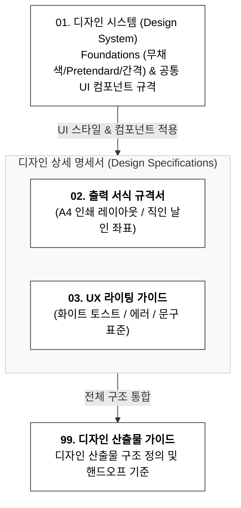

# [디자인 산출물 가이드] HRIS System (Phase 1 MVP)

## 📌 디자인 산출물 구조 및 역할 정의

|**번호**|**산출물명 (문서 타이틀)**|**핵심 질문**|**주요 내용 및 포함 범위**|**주요 활용 대상**|
|---|---|---|---|---|
|**01**|**디자인 시스템**      _(Design System)_|**어떤 시각적 규칙과 컴포넌트로 화면을 구성하는가?**|• 무채색(Zinc-900 / Neutral Gray) + Semantic 포인트 컬러      • Pretendard 단일 서체 반응형 타이포그래피 계층      • 8px 그리드, 간격 및 PC/Mobile 반응형 레이아웃 규격      • 7대 공통 컴포넌트 (버튼, 인풋, 테이블/카드, 뱃지, 모달 등)|UI/UX 디자이너,      프론트엔드 개발자|
|**02**|**출력 서식 규격서**      _(Print Template Spec)_|**A4 출력 및 직인 날인 서식은 어떻게 렌더링되는가?**|• A4 인쇄 여백(상하 25mm, 좌우 20mm) 및 pt 폰트 스케일      • 재직/경력증명서(1P 고정) 및 품의서(가변 다장) 레이아웃      • 우측 상단 2단 결재선 및 대표 직인 오버레이 좌표|UI/UX 디자이너,      프론트/백엔드 개발자|
|**03**|**UX 라이팅 가이드**      _(UX Writing Guide)_|**사용자에게 어떤 어조와 문구로 피드백을 주는가?**|• 정중하고 명확한 B2B SaaS 보이스 앤 톤 (`~합니다`, `~해 주세요`)      • 날짜, 시간, 금액, 연차 데이터 표준 표기 규칙      • 화이트 카드 상단 3초 토스트, 모달, Empty State 표준 문구      • 8대 기능 모듈별 시스템 피드백 문구 매트릭스|UI/UX 디자이너,      기획자, 프론트엔드|
|**99**|**디자인 산출물 가이드**      _(Design Guide)_|**디자인 산출물이 어떻게 구성되고 협업에 활용되는가?**|• 디자인 3대 산출물 구조 정의 및 문서 인덱스      • 피그마(Figma) 작업 환경 및 개발 핸드오프 가이드      • 기획 산출물(`planning`) 및 기술 명세서(`technical`) 연계 기준|전체 프로젝트 팀|

## 📑 산출물별 상세 목차 및 핵심 요약

### 1. 디자인 시스템 (Design System)

> 전체 시스템의 UI/UX 일관성을 확립하고, 디자이너와 프론트엔드 개발자 간의 통일된 컴포넌트 구현 기준을 제공하는 최상위 디자인 파운데이션 명세서입니다.

|**Depth 1**|**Depth 2**|**주요 내용**|
|---|---|---|
|**1. 개요 및 디자인 원칙**|1.1 시스템 개요 & 작업 환경|• Minimal Monochrome 테마, 반응형 3대 해상도(Desktop 1280+, Tablet 768~1279, Mobile ~767)|
||1.2 4대 UI/UX 디자인 원칙|• 간결성(Simplicity), 명확성(Clarity), 일관성(Consistency), 효율성/접근성(Touch & Efficiency)|
|**2. 디자인 파운데이션**|2.1 컬러 시스템|• Primary Black(`Zinc-900`), Grayscale(`Zinc-50~700`), Semantic 4대 상태 포인트 컬러|
||2.2 타이포그래피|• **`Pretendard` 단일 서체** 기반 반응형 타입 스케일 (Display 28/24px ~ Caption 12px)|
||2.3 스페이싱 & 그리드|• 8px 배수 시스템 (`space-1 (4px)` ~ `space-12 (48px)`), 본문 32px 패딩|
||2.4 반응형 레이아웃 규격|• Desktop: 240px LNB / Mobile: 56px 헤더, 사이드 드로어, 최소 터치 타겟 `44px` 보장|
||2.5 라운드, 그림자 및 Z-Index|• 모서리 곡률(Radius: 4/8/12/9999px), 미니멀 Shadow(`sm/md/xl`), 6단계 Z-Index 계층도|
|**3. 공통 UI 컴포넌트 규격**|3.1 버튼 (Buttons)|• Primary, Secondary, Danger, Ghost 스타일 및 Large/Medium/Small 사이즈 규격|
||3.2 폼 & 입력 필드 (Forms)|• 높이 40px 인풋, 무채색 포커스 링, 유효성 검증 실패 시 Red border & 하단 에러 텍스트|
||3.3 상태 뱃지 (Badges)|• 4대 업무 상태(`대기`, `승인`, `반려`, `취소`) 및 역할 태그 시맨틱 규격 (24px)|
||3.4 데이터 테이블 & 카드 리스트|• Desktop: 48px 행 높이 데이터 테이블 $\leftrightarrow$ Mobile: 가로 스크롤 방지 카드형 리스트 전환|
||3.5 모달 & 다이얼로그|• 440px/640px 모달, Desktop 우측 정렬 $\leftrightarrow$ Mobile 가로 100% 분할 모달 푸터|
||3.6 토스트 알림|• 화면 상단 중앙 플로팅 화이트 카드 토스트 (3.0초 자동 페이드아웃)|
||3.7 아바타 & 프로필|• 32px / 40px / 80px 프로필 아바타 및 이미지 미등록 시 Fallback 규격|
|**4. 인터랙션 & 상태 매트릭스**|4.1 6대 공통 상태 정의|• `Default`, `Hover`, `Active`, `Focus-visible`, `Disabled`, `Loading(Spinner)` 인터랙션|
||4.2 트랜지션 & 모션 토큰|• 150ms ~ 200ms 단위의 군더더기 없는 마이크로 인터랙션 타이밍 함수|
||4.3 Empty State|• 데이터 0건 시 40×40 라인 아이콘 + 타이틀 + 서브 설명 + 액션 CTA 버튼 중앙 정렬|
||4.4 로딩 & 스켈레톤 UI|• 인라인 16/24px 스피너 및 초기 레이아웃 깜빡임 방지용 펄스 스켈레톤 블록|

### 2. 출력 서식 규격서 (Print Template Spec)

> 증명서 발급 및 결재 완료 문서의 A4 PDF 변환 및 인쇄(Print) 레이아웃, 결재선 및 직인(인감) 렌더링 좌표를 정의한 출력 명세서입니다.

|**Depth 1**|**Depth 2**|**주요 내용**|
|---|---|---|
|**1. 개요 및 공통 인쇄 파운데이션**|1.1 문서 목적 및 적용 대상|• 증명서 모듈(CRT: 재직/경력) 및 결재 문서 모듈(DOC: 품의/신청서) 인쇄 뷰|
||1.2 A4 용지 규격 및 여백|• A4 용지(`210mm × 297mm`), 상하 25mm / 좌우 20mm 여백 (유효 인쇄 영역: 170×247mm)|
||1.3 인쇄 타이포그래피 & 컬러|• Title 20pt Bold ~ Table 10pt 스케일, Monochrome K100 흑백 기본 및 인쇄선 규격|
||1.4 공통 인쇄 요구사항|• UI 비노출, 서식별 페이지 정책 분기, 표 쪼개짐 방지, 다장 출력 시 페이지 번호 표기|
|**2. 증명서 서식 규격**|2.1 대상 서식 및 레이아웃 개요|• **1페이지 고정형 (Fixed 1-Page)** 서식, 재직증명서 및 경력증명서 레이아웃|
||2.2 상단 헤더 및 문서 제목|• 좌상단 발급번호(`제 CRT- 호`) 및 중앙 20pt Bold 밑줄 서식 타이틀|
||2.3 표 세부 내용 및 입력 규칙|• 인적 사항 4단 그리드 표, 재직기간 vs 퇴사자 경력기간(입사일~퇴사일) 자동 분기|
||2.4 증명 문구 및 발급 일자|• 공식 증명 문구("위와 같이 재직(경력)하고 있음을 증명합니다.") 및 발급일자 중앙 정렬|
||2.5 회사 정보 및 직인 날인 위치|• 회사 상호, 대표이사 성명 끝 글자에 회사 직인(2cm×2cm) 30% 오버레이 날인|
|**3. 결재 문서 출력 서식 규격**|3.1 대상 서식 및 레이아웃 개요|• **가변 다장형** 서식 (일반/지출 품의서, 교육 신청서 본문 길이에 따른 자동 확장)|
||3.2 우측 상단 결재선 규격|• 1페이지 우측 상단 고정 **2단 결재선 (`[기안] - [승인]`)**, 승인 시 대표 직인 자동 날인|
||3.3 본문 항목 및 금액 표기 규칙|• 기안 정보 표, 품의 금액 한글 병기 (`금 일백오십만원정 (₩ 1,500,000)`), 상세 내역 본문|
||3.4 다장 출력 시 처리 규칙|• 1P 결재선 고정, 표 중간 잘림 방지 이관, 하단 중앙 페이지 번호 (`- 1 / 2 -`) 표출|
|**4. 직인 렌더링 & 위변조 방지**|4.1 직인 이미지 에셋 규격|• 투명 배경 PNG(300 DPI), 증명서용(21×21mm) 및 결재선용(15×15mm) 규격|
||4.2 위변조 방지 메타데이터|• 하단 여백 바깥 고유 문서 검증 코드(`HR-9A82-F41C`) 및 발급 시분초 타임스탬프|

### 3. UX 라이팅 가이드 (UX Writing Guide)

> 사용자가 시스템과 상호작용할 때 불필요한 혼란 없이 명확하고 신속하게 업무를 처리할 수 있도록 돕는 보이스 앤 톤 및 메시지 표준 명세서입니다.

| **Depth 1**            | **Depth 2**           | **주요 내용**                                                               |
| ---------------------- | --------------------- | ----------------------------------------------------------------------- |
| **1. 개요 및 라이팅 원칙**     | 1.1 시스템 보이스 앤 톤       | • 정중하고 신뢰감 있는 어조, 군더더기 없는 간결함, 해결 방법 중심의 안내                             |
|                        | 1.2 3대 문장 작성 원칙       | • 간결/명확, 해결책 명시, 일관된 종결어미 (`~되었습니다.`, `~해 주세요.`)                        |
|                        | 1.3 데이터 및 단위 표준 표기    | • 날짜(`YYYY.MM.DD`), 일시, 시간(24시간제), 금액(`1,500,000 원`), 연차(`1.0 일`), 전화번호 |
| **2. UI 컴포넌트별 텍스트 규칙** | 2.1 버튼 및 액션 레이블       | • Primary(명확한 동작 지칭), Secondary(취소/닫기), Danger(반려/삭제), 파일 다운로드          |
|                        | 2.2 입력 필드 텍스트         | • 명사형 라벨, 필수값 빨간 별표(`*`), 인풋 타입별 플레이스홀더 표준 문구                           |
|                        | 2.3 유효성 검증 에러 메시지     | • 인풋 하단 붉은색 12px 에러 (필수 누락, 이메일/비밀번호 형식, 글자 수, 금액, 날짜 순서)               |
| **3. 시스템 피드백 & 안내 표준** | 3.1 토스트 알림 메시지        | • **화이트 카드 기반** + 초록 체크/빨간 경고 아이콘 포인트 (3.0초 소멸)                         |
|                        | 3.2 작업 확인 모달 문구       | • 결재 승인, 결재 반려, 휴가 취소, 기안 회수, 계정 비활성화 확인 문구 표준                          |
|                        | 3.3 Empty State 안내 문구 | • 결재 문서함, 휴가 내역, 출퇴근 기록, 증명서, 구성원 목록 데이터 없음 안내                          |
| **4. 기능별 주요 메시지 매트릭스** | 4.1 로그인 & 계정 (`LOG`)  | • 로그인 진입, 로그아웃 완료, 계정 불일치, 비활성화 계정 안내 문구                                |
|                        | 4.2 근태 관리 (`ATT`)     | • 출근/퇴근 완료 토스트, 직접 정정 완료, 중복 출근 주의, 미래 시각 에러                            |
|                        | 4.3 휴가 관리 (`VAC`)     | • 휴가 신청/취소 완료 토스트, 주말 제외 차감 안내, 잔여 연차 부족 에러                             |
|                        | 4.4 결재 문서 (`DOC`)     | • 기안/승인/반려/회수 완료 토스트, 반려 사유 누락, 금액 에러                                   |
|                        | 4.5 증명서 발급 (`CRT`)    | • 증명서 즉시 발급 완료 토스트, 발급 용도 누락 에러, 재직 상태 불일치                              |
|                        | 4.6 구성원 관리 (`MEM`)    | • 신규 구성원 등록, 정보 수정, 계정 비활성화 완료, 사번/이메일 중복 에러                            |
|                        | 4.7 회사 설정 (`SET`)     | • 회사 정보 저장, 직인 이미지 등록/삭제 완료 토스트, 파일 포맷/용량 에러                            |
