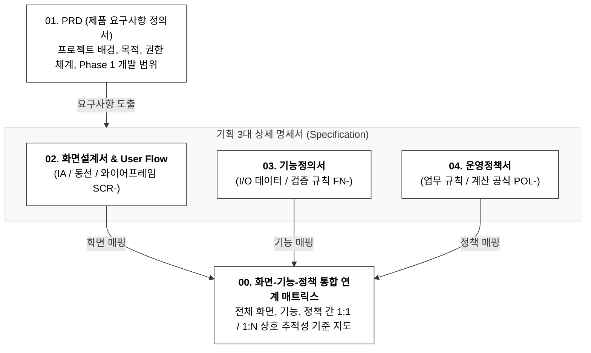

# [기획 산출물 가이드] HRIS System (Phase 1 MVP)

## 📌 기획 5대 산출물 구조 및 역할 정의

| **번호** | **산출물명 (문서 타이틀)**                                             | **핵심 질문**                  | **주요 내용 및 포함 범위**                                                                                                                 | **주요 활용 대상**           |
| ------ | ------------------------------------------------------------- | -------------------------- | --------------------------------------------------------------------------------------------------------------------------------- | ---------------------- |
| **00** | **통합 연계 매트릭스**  _(Traceability Matrix)_                 | **각 화면/기능/정책이 어떻게 연결되는가?** | • 화면(`SCR`) $\rightarrow$ 기능(`FN`) $\rightarrow$ 정책(`POL`) 1:1/1:N 연계 총괄표  • 메뉴별 화면 역할, 이용 권한 및 공통 정책 적용 기준 안내              | 전체 프로젝트 팀, PM, QA 검수자  |
| **01** | **PRD (제품 요구사항 정의서)**  _(Product Requirement Document)_ | **왜, 무엇을 만드는가?**           | • 프로젝트 배경, 목적, 핵심 목표(KPI), 2단계 권한 체계(`ADMIN`/`USER`)  • Phase 1 MVP 개발 범위(In/Out-Scope)  • 핵심 사용자 시나리오 및 비기능 요구사항     | C-Level, PM, 전체 프로젝트 팀 |
| **02** | **화면설계서 & User Flow**  _(UI/UX Specification)_          | **어떻게 보여지고 이동하는가?**        | • 정보 구조(IA), 공통 사이드바 레이아웃 규격  • 핵심 6대 업무 흐름도(User Flow)  • 12개 전체 화면 와이어프레임 및 UI 인터랙션 PIN 매핑                          | UI/UX 디자이너, 프론트엔드 개발자  |
| **03** | **기능정의서**  _(Feature Spec)_                             | **어떤 세부 기능을 제공하는가?**       | • 19개 세부 기능(`FN-`) 목록 및 CRUD 작업 유형  • 시스템 공통 처리 기준 (세션, 통화 표기, 정렬, 공통 검증)  • 기능별 입력/출력 데이터 규격 및 유효성 검증(Validation) 명세 | 백엔드/프론트엔드 개발자, QA 검수자  |
| **04** | **운영정책서**  _(Business Rules)_                           | **어떤 업무 규칙과 공식을 따르는가?**    | • 17개 운영 정책 총괄 요약표(`POL-`), 권한 통제 기준  • 계정/휴가/결재 통합 라이프사이클 및 상태 전이표  • 주말/공휴일 제외 연차 일수 및 근무시간 산출 계산 수식                | HR 운영 담당자, 백엔드 개발자     |

## 📑 산출물별 상세 목차 및 핵심 요약

### 1. PRD (제품 요구사항 정의서)

> 프로젝트의 추진 배경과 목표, 개발 범위(In/Out-Scope), 권한 체계 및 핵심 사용자 시나리오를 정의하는 최상위 기준 문서입니다.

| **Depth 1**           | **Depth 2**                 | **주요 내용**                                              |
| --------------------- | --------------------------- | ------------------------------------------------------ |
| **1. 프로젝트 개요**        | 1.1 배경 및 목적                 | • 추진 배경, 불필요한 기능 제거를 통한 경량화 목적 및 기대효과               |
|                       | 1.2 시스템 정의 및 핵심 목표          | • 자사 전용 웹 HR 시스템 정의 및 근태/결재 처리 시간 단축 정량/정성 목표(KPI)     |
| **2. 사용자 역할 및 권한 체계** | 2.1 관리자 (`ADMIN`) 권한        | • 회사 설정, 구성원 관리, 전사 근태 모니터링, 휴가/문서 1단계 결재 전결 권한        |
|                       | 2.2 일반 임직원 (`USER`) 권한      | • 출퇴근 체크/정정, 휴가 신청/취소, 결재 기안, 증명서 무결재 즉시 발급 등 기본 권한    |
| **3. 전체 로드맵 및 개발 범위** | 3.1 단계별 전체 로드맵              | • 제품 단계별 발전 방향 및 차수별(Phase 1 MVP → Phase 2 고도화) 마일스톤   |
|                       | 3.2 금번 개발 범위 (In-Scope)     | • 계정, 근태, 휴가, 결재/증명서, 구성원, 회사 설정 등 Phase 1 실제 구축 기능 목록 |
|                       | 3.3 차기 개발 범위 (Out-of-Scope) | • 모바일 앱, 전사 캘린더, 외부 메신저 연동 등 금번 개발에서 제외되는 기능 명시        |
| **4. 핵심 사용자 시나리오**    | 4.1 일반 임직원 핵심 시나리오          | • 일반 직원의 계정 가입, 근태 정정, 휴가 신청, 품의서 기안 등 엔드투엔드(E2E) 흐름   |
|                       | 4.2 관리자(대표) 핵심 시나리오         | • 관리자의 구성원 초대, 전사 근태 모니터링, 휴가/결재 1단계 심사 등 주요 관리 흐름     |
| **5. 비기능 요구사항**       | 5.1 보안 및 데이터 보호             | • 비밀번호 단방향 암호화 저장 및 서버 레벨 데이터 접근 권한 통제 기준              |
|                       | 5.2 감사 로그 및 이력 관리           | • 근태 시간 정정, 휴가/문서 결재 이력, 증명서 발급 감사 로그 영구 보존 기준         |
|                       | 5.3 성능 및 시스템 품질             | • 1초 이내 서버 응답 속도 및 직인 날인 PDF 즉각 렌더링 품질 목표              |
|                       | 5.4 시스템 환경 제약               | • PC 웹 브라우저(Chrome, Whale 등) 최적화 및 지원 환경 기준            |

### 2. 화면설계서 & User Flow

> 전체 정보 구조(IA), 레이아웃 규격, 사용자 동선(User Flow) 및 와이어프레임과 UI 인터랙션을 정의한 화면 명세서입니다.

| **Depth 1**               | **Depth 2**                     | **주요 내용**                                                               |
| ------------------------- | ------------------------------- | ----------------------------------------------------------------------- |
| **1. 문서 식별자 체계**          | 1.1 식별자 구분 체계                   | • 화면(`SCR-`), 기능(`FN-`), 정책(`POL-`) 표준 코드 체계 정의                         |
|                           | 1.2 모듈별 Prefix 정의               | • 8대 핵심 영역(`LOG`, `MY`, `ATT`, `VAC`, `DOC`, `CRT`, `MEM`, `SET`) 코드 정의 |
| **2. 정보 구조 (IA)**         | 2.1 사이드바 그룹형 구조                 | • Depth 1(헤더 라벨) 및 Depth 2(이동 메뉴), 하단 프로필 계층 구조도                        |
|                           | 2.2 권한별 화면 접근 매트릭스              | • `USER` vs `ADMIN` 화면별 접근 권한 및 메뉴 숨김(403) 제어 정책                        |
|                           | 2.3 전체 화면 목록 & URL              | • 12개 전체 화면 ID, 화면명, 이용 권한 및 URL 라우팅 경로 정의                              |
| **3. 공통 레이아웃 명세**         | 3.1 좌측 고정 사이드바 (LNB)            | • 240px 고정 사이드바 규격 및 권한별 메뉴 노출 기준                                       |
|                           | 3.2 상단 상호 / 하단 프로필              | • 회사명 동적 표출, 아바타/사용자 정보 노출 및 개인화 액션 카드 규격                               |
|                           | 3.3 공통 인터랙션 및 상태 표기             | • 레이어 모달 동작, Empty State 표기, 4대 표준 상태 표기 규칙                             |
| **4. 사용자 동선 (User Flow)** | 4.1 계정/내정보 Flow                 | • 초대 메일 수신부터 비밀번호 등록, 로그인, 프로필 설정까지의 이동 동선                              |
|                           | 4.2 근태 기록/정정 Flow               | • 출퇴근 체크 및 직원의 근태 시각 직접 정정, 관리자 모니터링 동선                                 |
|                           | 4.3 휴가 신청/결재 Flow               | • 휴가 신청, 가용연차 자동 검증, 본인 취소 및 관리자 승인/반려 동선                               |
|                           | 4.4 결재 문서 Flow                  | • 교육/지출 기안 작성, 상신 및 대표 1단계 승인(직인 날인)/반려 동선                              |
|                           | 4.5 증명서 즉시 발급 Flow              | • 재직/경력증명서 신청 및 무결재 즉시 PDF 생성/출력 동선                                     |
|                           | 4.6 회사 설정 Flow                  | • 회사 기본 정보 수정 및 직인(인감) PNG 이미지 등록 동선                                    |
| **5. 화면별 상세 와이어프레임**      | 5.1 계정 & 내 정보 (`SCR-LOG`, `MY`) | • 로그인, 비밀번호 설정, 내 정보 관리 화면 와이어프레임 및 UI 인터랙션 PIN                         |
|                           | 5.2 근태 관리 (`SCR-ATT`)           | • 출퇴근 기록, 본인 정정 이력 팝업, 전사 근태 현황 화면 와이어프레임 및 PIN                         |
|                           | 5.3 휴가 관리 (`SCR-VAC`)           | • 휴가 내역, 휴가 신청 모달, 휴가 결재 및 반려 사유 모달 와이어프레임 및 PIN                        |
|                           | 5.4 결재 문서 (`SCR-DOC`)           | • 기안 목록, 결재 문서 작성, 상세 및 1단계 심사 화면 와이어프레임 및 PIN                          |
|                           | 5.5 증명서 발급 (`SCR-CRT`)          | • 증명서 즉시 발급 신청 및 전사 발급 이력 관리 화면 와이어프레임 및 PIN                            |
|                           | 5.6 구성원 관리 (`SCR-MEM`)          | • 전사 구성원 조회, 신규 초대 및 상세 관리 모달 와이어프레임 및 PIN                              |
|                           | 5.7 설정 (`SCR-SET`)              | • 회사 기본 정보 관리 및 직인 이미지 업로드 화면 와이어프레임 및 PIN                              |

### 3. 기능정의서 (Feature Spec)

> 화면의 모든 인터랙션을 시스템 단위의 기능(`FN-`)으로 정의하고, 입출력 데이터 규격과 유효성 검증(Validation)을 기술한 명세서입니다.

| **Depth 1**         | **Depth 2**                    | **주요 내용**                                                       |
| ------------------- | ------------------------------ | --------------------------------------------------------------- |
| **1. 기능 목록표**       | 1.1 기능 목록표 (Matrix)            | • 19개 전체 기능 ID(`FN-LOG-01` ~ `FN-SET-01`), 메뉴 구분, 작업 유형 및 매핑 관계 |
| **2. 시스템 공통 처리 기준** | 2.1 세션 및 접근 권한 제어              | • 비로그인 강제 이동, 비인가 접근 차단(403) 및 세션 유지/종료 기준                      |
|                     | 2.2 데이터 표기 및 처리 기준             | • 서버 현재 시각(KST) 기록 기준, 통화 단위 콤마 표기, 최신순 정렬 규칙                   |
|                     | 2.3 입력값 검증 및 알림 기준             | • 필수값 누락 테두리 강조, 중복 등록 방지 알림, 완료 안내 토스트 규칙                      |
| **3. 메뉴별 세부 기능 명세** | 3.1 계정 및 내 정보 (`FN-LOG`, `MY`) | • 로그인 인증, 비밀번호 설정/활성화, 프로필 사진/연락처 수정, 비밀번호 변경 기능                |
|                     | 3.2 근태 관리 (`FN-ATT`)           | • 출퇴근 체크, 월별 근태 조회, 근무시간 계산, 직접 정정 및 전사 근태 조회 기능                |
|                     | 3.3 휴가 관리 (`FN-VAC`)           | • 휴가 신청/가용연차 검증, 관리자 1단계 승인/반려, 본인 취소 및 연차 복구 기능                |
|                     | 3.4 결재 문서 관리 (`FN-DOC`)        | • 결재 문서(교육/지출) 작성/상신, 문서 상세 조회/직인 승인, 반려 사유 처리 기능               |
|                     | 3.5 증명서 발급 (`FN-CRT`)          | • 재직/경력증명서 무결재 즉시 PDF 생성/다운로드 및 전사 발급 이력 관리 기능                  |
|                     | 3.6 구성원 관리 (`FN-MEM`)          | • 전사 구성원 조회, 신규 초대 메일 발송, 인사정보/권한/상태/연차 수정 기능                   |
|                     | 3.7 회사 설정 (`FN-SET`)           | • 회사 기본 정보 관리 및 직인(인감) 이미지 파일 등록/삭제 기능                          |

### 4. 운영정책서 (Business Rules)

> 시스템 전반의 업무 규칙, 권한 통제 기준, 상태 전이 라이프사이클 및 연차/근무시간 산출 공식을 정의한 기준 문서입니다.

| **Depth 1**          | **Depth 2**                                  | **주요 내용**                                                        |
| -------------------- | -------------------------------------------- | ---------------------------------------------------------------- |
| **1. 운영 정책 총괄표**     | 1.1 핵심 운영 정책 요약                              | • 17개 운영 정책 ID(`POL-COM-01` ~ `POL-SET-01`), 적용 대상 및 핵심 업무 규칙 요약 |
| **2. 공통 기준 및 업무 상태** | 2.1 시스템 역할 및 권한 체계 (`POL-COM-01`)            | • 최고관리자(`ADMIN`)와 일반임직원(`USER`) 2단계 권한별 업무 범위 및 통제 기준            |
|                      | 2.2 통합 업무 상태 및 전이 흐름 (`POL-COM-02`)          | • 계정/휴가/결재 문서의 상태 라이프사이클 정의 및 완료 상태 불변(임의 변경 불가) 원칙              |
| **3. 메뉴별 상세 운영 정책**  | 3.1 계정 및 내 정보 관리 정책 (`POL-LOG`, `MEM`, `MY`) | • 비밀번호 보안 규칙, 링크 유효기간, 동료 정보 열람 범위, 초기 연차 세팅 및 프로필 규격            |
|                      | 3.2 근태 관리 운영 정책 (`POL-ATT`)                  | • 출퇴근 기록 시각 기준, 근무시간 산출 공식, 임직원 직접 정정 권한 및 감사 로그 영구 보존 기준        |
|                      | 3.3 휴가 관리 운영 정책 (`POL-VAC`)                  | • 휴가 사용 단위, 주말/공휴일 제외 일수 산출, 가용 연차 계산 수식, 승인/반려/취소 시 연차 가감 공식    |
|                      | 3.4 결재 문서 관리 정책 (`POL-DOC`)                  | • 교육/지출결의 양식 기준, 대표 1인 결재 규칙, 승인 시 회사 직인 자동 날인 및 반려 피드백 기준       |
|                      | 3.5 증명서 발급 관리 정책 (`POL-CRT`)                 | • 증명서 무결재 즉시 발급 원칙, 서식 자동 완성 기준 및 전사 발급 감사 로그 관리 정책              |
|                      | 3.6 회사 설정 및 직인 관리 정책 (`POL-SET`)             | • 회사 기본 정보 관리, 직인 이미지 규격 및 결재/증명서 자동 날인 연동 정책                    |
