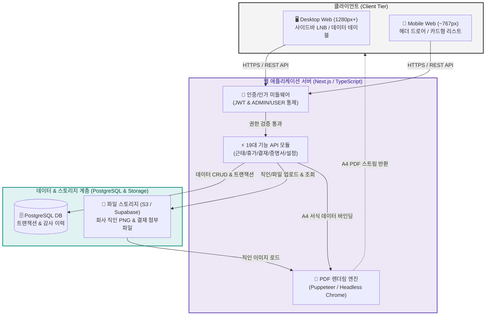

# [시스템 아키텍처 정의서] HRIS System (Phase 1 MVP)

> 본 문서는 **HRIS System (Phase 1 MVP)**의 기획(`planning`) 및 디자인(`design`) 요구사항을 실제 소프트웨어로 구현하기 위한 **최상위 기술 아키텍처 명세서**입니다. 프론트엔드, 백엔드, 데이터베이스 및 외부 렌더링 엔진 간의 시스템 구조와 핵심 데이터 흐름을 정의합니다.

## 1. 개요 및 아키텍처 원칙 (Overview & Principles)

### 1.1 시스템 개요 & 개발 목표

- **시스템명**: 자사 전용 HRIS System (Phase 1 MVP)
    
- **서비스 환경**: **반응형 웹 (Responsive Web - PC Web & Mobile Web 최적화)**
    
- **시스템 구조 형태**: **모듈형 단일 웹 애플리케이션 (Modular Monolith Web Application)**
    
    - 과도한 분산 시스템(MSA) 대신, 빠르고 안정적인 개발과 유지보수가 용이하도록 백엔드와 프론트엔드가 명확히 분리된 경량 모듈 구조를 채택합니다.
        
- **핵심 기술 목표**:
    
    - 전 화면 **1.0초 이내** 빠른 API 응답 속도 보장
        
    - 근태 및 결재 데이터의 **원자성(ACID) 및 감사 이력(Audit Log)** 100% 보존
        
    - A4 출력 서식 및 대표 직인(인감)의 **왜곡 없는 1:1 정비율 PDF 렌더링**
        

### 1.2 4대 엔지니어링 아키텍처 원칙 (Engineering Principles)

| **원칙 (Principle)**                        | **기술적 정의**                           | **기획 / 디자인 요구사항 반영 기준**                                                                       |
| ----------------------------------------- | ------------------------------------ | --------------------------------------------------------------------------------------------- |
| 1. Simplicity & Speed<br><br>(경량화 및 신속성)  | 오버엔지니어링을 배제하고 단순하고 명확한 기술 스택 적용      | • 복잡한 캐시 서버 없이 단일 DB와 최적화된 인덱스로 빠른 속도 확보<br><br>• 모바일 환경에서도 가벼운 페이지 로딩 및 반응형 화면 전환            |
| 2. Data Integrity<br><br>(데이터 무결성 & 감사)   | 휴가 차감, 근태 정정 등 비즈니스 로직의 트랜잭션 보장      | • 근태 시간 직접 정정 시 원본 데이터 덮어쓰기 금지 및 수정 이력 테이블 분리 보존<br><br>• 연차 신청/취소 시 동시성 이슈 없는 정확한 잔여일수 계산 보장 |
| 3. Security & RBAC<br><br>(역할 기반 보안 격리)   | 2단계 권한(`ADMIN`/`USER`)의 서버 레벨 엄격한 통제 | • 프론트엔드 메뉴 숨김뿐 아니라 백엔드 API 엔드포인트 단에서 비인가 접근(403) 차단<br><br>• 비밀번호 단방향 암호화(bcrypt/Argon2) 저장   |
| 4. Pixel-Perfect PDF<br><br>(결정론적 출력 렌더링) | 화면과 인쇄물 간 오차 없는 서버/클라이언트 PDF 생성      | • 브라우저마다 제각각인 인쇄 편차를 방지하고 일관된 A4 PDF 생성<br><br>• 대표이사 직인(인감) PNG 이미지의 정밀 오버레이 날인 보장           |


---
## 2. 권장 기술 스택 (Technology Stack)

Phase 1 MVP의 빠른 개발과 안정적인 운영, 그리고 앞서 확정한 **무채색 디자인 시스템 및 A4 PDF 출력 서식**을 가장 완벽하게 지원하는 기술 스택 명세입니다.

### 2.1 기술 스택 요약표

| **계층 (Layer)** | **권장 기술 (Tech Stack)**                              | **주요 라이브러리 / 도구**          | **선정 및 적용 사유**                                                                |
| -------------- | --------------------------------------------------- | -------------------------- | ----------------------------------------------------------------------------- |
| **Frontend**   | **Next.js (React) + TypeScript**                    | Tailwind CSS, Lucide React | • 8px 그리드 및 반응형 웹 레이아웃 구현 최적화<br><br>• Pretendard 단일 서체 및 무채색 토큰 일괄 제어        |
| **Backend**    | **Next.js API Routes**<br><br>_(또는 Node.js NestJS)_ | Zod (유효성 검증), JWT          | • 프론트/백엔드 단일 언어(TypeScript) 통일로 빠른 개발<br><br>• 19개 API 엔드포인트의 1초 이내 빠른 데이터 처리 |
| **Database**   | **PostgreSQL**                                      | Prisma ORM                 | • 연차 계산, 결재 상태 전이의 엄격한 트랜잭션(ACID) 보장<br><br>• 직관적인 스키마 관리 및 마이그레이션 용이성        |
| **PDF Engine** | **Puppeteer**<br><br>_(또는 `@react-pdf/renderer`)_   | Chrome Headless            | • 브라우저별 인쇄 오차를 없앤 서버 사이드 1:1 A4 PDF 생성<br><br>• 대표 직인 PNG 이미지의 정밀 좌표 오버레이 보장  |
| **Auth / Sec** | **JWT (HttpOnly Cookie)**                           | bcrypt (비밀번호 암호화)          | • 2단계 권한(`ADMIN`/`USER`) 서버 레벨 격리<br><br>• XSS/CSRF 보안 취약점 사전 차단              |
| **Storage**    | **AWS S3** _(또는 로컬 스토리지)_                           | Multer                     | • 회사 직인(인감) PNG 및 결재 첨부 파일 안전 보관                                              |

### 2.2 계층별 상세 선정 이유 및 역할

#### 1) 프론트엔드: Next.js + TypeScript + Tailwind CSS

- **디자인 시스템과의 완벽한 일치**: Tailwind CSS의 설정 파일(`tailwind.config.js`)에 앞서 정의한 무채색 컬러 토큰(`primary-900`, `border-default`)과 8px 간격 토큰을 1:1로 등록하여 디자인 누락을 원천 차단합니다.
    
- **반응형 웹 지원**: 별도의 앱 개발 없이도 PC(1280px+) 대시보드와 모바일(360px~) 카드 리스트 간의 유연한 화면 전환이 가능합니다.
    

#### 2) 데이터베이스 & ORM: PostgreSQL + Prisma

- **데이터 무결성(Integrity) 보장**: 결재 승인 시 직인 자동 날인, 휴가 신청 시 잔여 연차 차감 등 돈이나 법적 효력과 관련된 비즈니스 로직을 안전하게 트랜잭션으로 묶어 처리합니다.
    
- **감사 로그(Audit) 적재**: 직원의 근태 시각 정정 이력, 결재 반려 사유, 증명서 발급 이력을 테이블별로 분리하여 영구 보존합니다.
    

#### 3) PDF 렌더링 엔진: Puppeteer (Headless Chrome)

- **A4 출력 규격 오차 방지**: 사용자의 PC 환경이나 브라우저 종류(Chrome, Safari, Whale)에 상관없이 서버에서 동일한 Chrome 엔진으로 `02_출력서식규격서.md`의 상하좌우 여백과 폰트 크기를 유지하며 정밀하게 PDF를 렌더링합니다.
    
- **직인 오버레이 렌더링**: 대표이사 이름 마지막 글자 위에 투명 배경 PNG 직인이 정확히 30% 겹쳐서 찍히도록 좌표를 고정합니다.
    

#### 4) 인증 및 권한 제어: JWT & RBAC

- **2단계 권한 엄격 통제**: 일반 직원(`USER`)이 관리자 전용 API(구성원 초대, 전사 근태 조회, 직인 설정 등)를 직접 호출하더라도 서버 미들웨어에서 즉시 `403 Forbidden` 에러를 반환합니다.


---
## 3. 시스템 구조도 및 데이터 흐름 (System Architecture & Data Flow)

### 3.1 전체 시스템 구조 다이어그램 (Architecture Overview)

사용자 브라우저(PC/모바일)부터 웹 서버, 데이터베이스, PDF 생성 엔진까지의 전체 연결 구조입니다.



### 3.2 3대 핵심 비즈니스 데이터 흐름 (Core Data Flows)

시스템에서 가장 중요한 **인증, 결재/직인 날인, 증명서 PDF 발급**의 처리 흐름입니다.

#### 1) 사용자 인증 및 권한 통제 흐름 (Authentication Flow)

```
[사용자 로그인 요청] 
  │
  ▼
[백엔드: 이메일/비밀번호 검증 (bcrypt)]
  │
  ├─▶ 불일치: 401 Unauthorized 에러 반환[cite: 4]
  │
  ▼ 일치
[JWT 토큰 생성 (역할: ADMIN / USER)] ──▶ [브라우저 HttpOnly 쿠키 저장]
  │
  ▼ API 호출 시
[미들웨어 권한 검사] ──▶ USER가 관리자 API 호출 시 즉시 403 차단[cite: 5]
```

#### 2) 결재 승인 및 직인 자동 날인 흐름 (Approval & Auto-seal Flow)

관리자(대표)가 결재 문서나 휴가를 최종 승인할 때 실행되는 안전한 트랜잭션 흐름입니다.

```
[관리자: '승인' 버튼 클릭][cite: 1, 4]
  │
  ▼
[DB 트랜잭션 시작 (BEGIN TRANSACTION)][cite: 5]
  │
  ├─ 1. 결재 문서 상태를 '승인(APPROVED)'으로 변경[cite: 5]
  ├─ 2. 회사 설정에 등록된 '대표 직인(인감) PNG' 경로 매핑[cite: 2]
  ├─ 3. 승인 일시(Timestamp) 기록[cite: 2]
  └─ 4. (휴가인 경우) 신청 직원의 잔여 연차 자동 차감[cite: 5]
  │
  ▼ 오류 없음
[DB 트랜잭션 커밋 (COMMIT)] ──▶ [3초 성공 토스트 알림 노출][cite: 4]
```

#### 3) 증명서 무결재 즉시 발급 & PDF 생성 흐름 (Certificate & PDF Flow)

직원이 재직/경력증명서를 신청했을 때 대기 없이 즉시 A4 PDF를 만드는 과정입니다.

```
[직원: 증명서 발급 신청 (용도 입력)][cite: 2, 4]
  │
  ▼
[백엔드: 신청자 인사 데이터(부서/입사일) 및 대표 직인 이미지 로드][cite: 2]
  │
  ▼
[A4 HTML 템플릿에 데이터 바인딩]
  │ (1페이지 고정 레이아웃 + 대표자명 끝 글자에 직인 30% 오버레이)[cite: 2]
  │
  ▼
[Puppeteer 엔진: A4 크기(210×297mm) 정밀 PDF 변환][cite: 2]
  │
  ▼
[브라우저로 PDF 스트림 전달] ──▶ [즉시 미리보기 및 다운로드 완료][cite: 2, 4]
```


---
## 4. 프로젝트 디렉터리 구조 (Project Directory Structure)

기획서의 8대 기능 모듈(`LOG`, `ATT`, `VAC`, `DOC`, `CRT`, `MEM`, `SET`, `MY`)과 디자인 시스템 컴포넌트가 1:1로 매핑되는 Next.js 기반 단일 코드베이스 디렉터리 구조입니다.

### 4.1 전체 디렉터리 트리 (Source Tree)

```
HRIS/
├── public/                         # 정적 에셋 (기본 로고, 폰트, 파비콘)
├── prisma/                         # 데이터베이스 스키마 및 마이그레이션
│   ├── schema.prisma               # PostgreSQL DB 모델 정의 (테이블 스키마)
│   └── seed.ts                     # 초기 관리자 계정 및 기본 설정 시드 데이터
│
├── src/
│   ├── app/                        # 화면 라우팅 (Next.js App Router) & API 엔드포인트
│   │   ├── (auth)/                 # [LOG] 인증 관련 화면 (로그인, 비밀번호 설정)
│   │   ├── (dashboard)/            # 사이드바(LNB) 공통 레이아웃이 적용되는 메인 화면
│   │   │   ├── attendance/         # [ATT] 내 근태 기록 / 전사 근태 현황
│   │   │   ├── vacations/          # [VAC] 휴가 신청 및 내역 / 휴가 결재 심사
│   │   │   ├── documents/          # [DOC] 결재 문서함 / 품의서 작성 및 심사
│   │   │   ├── certificates/       # [CRT] 증명서 발급함 / 전사 발급 이력
│   │   │   ├── members/            # [MEM] 구성원 관리 (관리자 전용)
│   │   │   ├── settings/           # [SET] 회사 정보 및 직인 관리 (관리자 전용)
│   │   │   └── mypage/             # [MY] 내 정보 수정 및 비밀번호 변경
│   │   │
│   │   └── api/                    # 19대 기능 REST API 엔드포인트 (`/api/v1/...`)
│   │       ├── auth/               # 로그인, 로그아웃, 세션 검증
│   │       ├── attendance/         # 출퇴근 체크, 시각 정정
│   │       ├── vacations/          # 휴가 신청, 승인, 반려, 취소
│   │       ├── documents/          # 품의서 작성, 결재, 반려
│   │       ├── certificates/       # 증명서 발급 및 PDF 생성 스트림
│   │       ├── members/            # 구성원 CRUD 및 권한 변경
│   │       └── settings/           # 회사 정보 수정 및 직인 업로드
│   │
│   ├── components/                 # 재사용 UI 컴포넌트 (`01_디자인시스템.md`)
│   │   ├── ui/                     # 디자인 파운데이션 공통 컴포넌트
│   │   │   ├── button.tsx          # Primary, Secondary, Danger, Ghost 버튼
│   │   │   ├── input.tsx           # 텍스트 인풋, 셀렉트 박스, 에러 표출
│   │   │   ├── modal.tsx           # 440px / 640px 모달 다이얼로그
│   │   │   ├── table.tsx           # PC 데이터 테이블 & Mobile 카드 리스트
│   │   │   ├── badge.tsx           # 4대 상태 뱃지 (대기, 승인, 반려, 취소)
│   │   │   └── toast.tsx           # 상단 플로팅 3초 화이트 토스트
│   │   ├── layout/                 # 사이드바(240px LNB), 헤더, 모바일 드로어
│   │   └── print/                  # A4 인쇄 및 PDF 전용 서식 템플릿 컴포넌트
│   │       ├── cert-template.tsx   # 재직/경력증명서 A4 서식 (1P 고정)
│   │       └── doc-template.tsx    # 결재 품의서 A4 서식 (가변 다장형)
│   │
│   ├── lib/                        # 비즈니스 핵심 로직 & 유틸리티
│   │   ├── db.ts                   # Prisma DB 클라이언트 연결 인스턴스
│   │   ├── auth.ts                 # JWT 토큰 발급 및 비밀번호 해싱(bcrypt)
│   │   ├── pdf.ts                  # Puppeteer 기반 A4 PDF 변환 엔진
│   │   └── vacation-calc.ts        # 주말/공휴일 제외 가용 연차 계산 수식
│   │
│   └── constants/                  # 정적 상수 & 메시지 (`03_UX라이팅가이드.md`)
│       └── messages.ts             # 토스트 메시지, 에러 문구, 모달 텍스트 모음
│
├── docs/                           # 기획/디자인/기술/QA 산출물 문서
├── tailwind.config.js              # 디자인 토큰(무채색, 8px 간격, Pretendard) 설정
└── package.json                    # 프로젝트 의존성 라이브러리 목록
```

### 4.2 주요 디렉터리별 역할 및 설계 기준

|**디렉터리 경로**|**주요 역할**|**기획/디자인 매핑 기준**|
|---|---|---|
|**`src/app/(dashboard)/`**|사이드바 레이아웃이 공통 적용되는 7대 업무 화면 라우팅|`02_화면설계서.md`의 12개 화면(`SCR-`)과 1:1 매핑|
|**`src/app/api/`**|데이터베이스 조작 및 비즈니스 로직을 수행하는 백엔드 엔드포인트|`03_기능정의서.md`의 19개 세부 기능(`FN-`)과 1:1 매핑|
|**`src/components/ui/`**|무채색 모노크롬 테마와 6대 상태 인터랙션을 갖춘 원자 단위 UI 컴포넌트|`01_디자인시스템.md`의 버튼, 인풋, 테이블, 뱃지, 모달 규격|
|**`src/components/print/`**|A4 규격(210×297mm)에 맞춘 서식 레이아웃 및 직인 오버레이 컴포넌트|`02_출력서식규격서.md`의 증명서 및 결재 문서 서식|
|**`src/lib/pdf.ts`**|브라우저 인쇄 오차를 방지하고 서버에서 일관된 PDF를 생성하는 엔진|`Puppeteer`를 통해 `print/` 서식 컴포넌트를 PDF 스트림으로 렌더링|
|**`src/constants/`**|일관된 톤앤매너 유지를 위한 시스템 피드백 문구 중앙 관리|`03_UX라이팅가이드.md`의 토스트, 에러, 모달 텍스트|

### 4.3 디렉터리 구조 적용 가이드 및 개발 유연성 (Implementation Flexibility)

- **표준 권장 기준 (Baseline Standard)**:
    
    - 본 디렉터리 구조는 기획 및 디자인 명세를 직관적으로 구현하기 위한 **Next.js App Router 기반의 권장 표준 레퍼런스**입니다.
        
- **개발 자율성 및 유연성 허용 (Flexibility)**:
    
    - 실제 개발 과정에서 사용 라이브러리(상태 관리 도구, 폼 검증 라이브러리 등), 프론트엔드/백엔드 분리 배포 환경, 또는 개발팀의 아키텍처 컨벤션에 따라 **세부 유틸리티 폴더 추가나 파일 위치의 합리적인 조정은 자율적으로 허용**합니다.
        
- **핵심 준수 원칙 (Non-negotiable Rules)**:
    
    - 단, 구조가 일부 변경되더라도 다음 **3대 도메인 격리 원칙**은 반드시 준수해야 합니다.
        
        1. **기능 모듈 분리**: 기획서의 8대 기능(`ATT`, `VAC`, `DOC`, `CRT` 등)이 명확히 모듈 단위로 구분되어 유지보수가 용이할 것
            
        2. **출력 서식 독립**: A4 인쇄 및 PDF 전용 컴포넌트(`components/print/`)는 일반 웹 UI 컴포넌트와 분리하여 서식 스타일 오염을 방지할 것
            
        3. **레이아웃 분리**: 사이드바가 있는 대시보드 영역과 사이드바가 없는 인증(로그인) 영역이 명확히 나뉠 것

