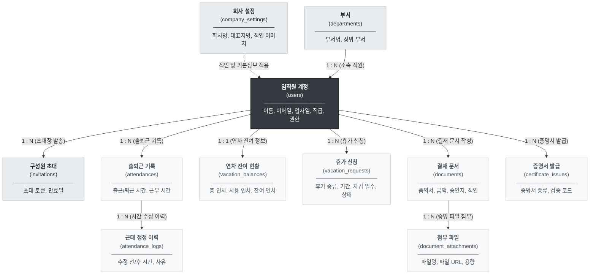

# [데이터베이스 설계서 & ERD] HRIS System (Phase 1 MVP)

> 본 문서는 **HRIS System (Phase 1 MVP)**의 기획(`planning`) 및 디자인(`design`) 요구사항을 관계형 데이터베이스로 모델링하기 위한 **물리 데이터베이스 설계서**입니다. PostgreSQL(Supabase 호환)을 기준으로 8대 핵심 업무 모듈의 테이블 스키마, 외래키(FK) 관계, 데이터 무결성 제약조건 및 감사 로그(Audit) 적재 기준을 정의합니다.

## 1. 개요 및 데이터 설계 원칙 (Overview & DB Principles)

### 1.1 데이터베이스 환경 및 명명 규칙 (Naming Conventions)

- **대상 DB 엔진**: **PostgreSQL 15+ (Supabase DB 100% 호환)**
    
- **문자셋 및 타임존 (Timezone)**:
    
    - 문자 인코딩: `UTF-8`
        
    - 시간 저장: **`TIMESTAMPTZ` (UTC 기준으로 저장하되, 조회 및 화면 렌더링 시 KST `Asia/Seoul` 변환)**
        
- **명명 표준 (Naming Standards)**:
    
    - **테이블명**: 소문자 복수형 스네이크 케이스 (`snake_case`) 적용 (예: `users`, `attendances`, `vacation_requests`)
        
    - **컬럼명**: 소문자 단수/스네이크 케이스 적용 (예: `user_id`, `vacation_type`, `approved_at`)
        
    - **기본키 (PK)**: `id` (UUID v4 또는 BIGSERIAL)
        
    - **외래키 (FK)**: `참조테이블_id` 형태 (예: `user_id`, `department_id`, `document_id`)
        
    - **열거형 (Enum)**: 대문자 스네이크 케이스 (예: `ADMIN`, `PENDING`, `APPROVED`)
        

### 1.2 전 테이블 공통 메타 컬럼 (Common Metadata Columns)

데이터 생성 및 변경 이력을 시스템 차원에서 추적하기 위해, 별도 이력 테이블을 제외한 모든 메인 엔티티에 아래 공통 컬럼을 필수로 포함합니다.

|**컬럼명**|**데이터 타입**|**Null 허용**|**기본값**|**설명**|
|---|---|---|---|---|
|**`id`**|`UUID` (또는 `BIGSERIAL`)|NO|`gen_random_uuid()`|각 테이블의 고유 식별자 (PK)|
|**`created_at`**|`TIMESTAMPTZ`|NO|`CURRENT_TIMESTAMP`|레코드 최초 생성 일시 (KST)|
|**`updated_at`**|`TIMESTAMPTZ`|NO|`CURRENT_TIMESTAMP`|레코드 최종 수정 일시 (KST)|

### 1.3 3대 데이터 설계 원칙 (DB Design Principles)

|**설계 원칙**|**상세 정의**|**기획 및 비즈니스 정책 반영 기준**|
|---|---|---|
|1. 트랜잭션 원자성      (ACID Integrity)|복수의 데이터 변경이 일어나는 업무의 동시성 및 무결성 보장|• **휴가 결재 승인 시**: 휴가 신청 상태 변경(`vacation_requests`)과 잔여 연차 차감(`vacation_balances`)을 **단일 트랜잭션**으로 처리      • **휴가 취소 시**: 차감되었던 가용 연차를 즉시 환원|
|2. 감사 추적성      (Audit Trail)|임직원의 데이터 수정 및 반려 사유의 불변(Immutable) 보존|• **근태 직접 정정**: 원본 출퇴근 시간 덮어쓰기 대신 `attendance_correction_logs`에 수정 전/후 시간 및 정정 사유 영구 적재      • **결재 반려**: `rejected_reason` 및 반려 일시 영구 보존|
|3. 출력 스냅샷 보존      (Document Snapshot)|인쇄 및 PDF 서식의 법적 공신력 유지를 위한 시점 데이터 보존|• **결재/증명서 발급 시**: 사원 정보가 훗날 변경(승진, 부서이동 등)되더라도 **발급 당시의 직급, 부서명, 대표 직인 이미지 경로**를 스냅샷 형태로 온전히 유지|

---
## 2. 전체 데이터 관계도 (ERD & Data Map)

우리가 앞서 기획한 **임직원, 근태, 휴가, 결재 문서, 증명서, 회사 설정** 데이터들이 서로 어떻게 연결(참조)되어 있는지 보여주는 전체 지도입니다.

### 2.1 8대 핵심 데이터 관계도

### 2.2 비즈니스 관점의 데이터 관계 요약표

|**기준 데이터 (부모)**|**연결되는 데이터 (자식)**|**연결 관계**|**실무 비즈니스 규칙 및 의미**|
|---|---|---|---|
|**부서** (`departments`)|**임직원** (`users`)|`1 : N`|하나의 부서에 여러 명의 직원이 소속됩니다.|
|**임직원** (`users`)|**출퇴근 기록** (`attendances`)|`1 : N`|한 직원이 매일 1건씩 출퇴근 기록을 생성합니다.|
|**출퇴근 기록** (`attendances`)|**근태 정정 이력** (`attendance_logs`)|`1 : N`|출퇴근 시간을 직접 수정할 때마다 수정 전/후 시간과 사유가 감사 로그로 누적됩니다.|
|**임직원** (`users`)|**연차 잔여 현황** (`vacation_balances`)|`1 : 1`|직원마다 연도별로 1개의 연차 현황(총 연차, 잔여 연차)을 가집니다.|
|**임직원** (`users`)|**휴가 신청** (`vacation_requests`)|`1 : N`|직원이 여러 번 휴가를 신청하며, 승인 완료 시 연차 현황에서 일수가 차감됩니다.|
|**임직원** (`users`)|**결재 문서** (`documents`)|`1 : N`|직원이 기안자(`drafter_id`)가 되어 문서를 올리고, 관리자가 승인자(`approver_id`)로 도장을 찍습니다.|
|**결재 문서** (`documents`)|**첨부 파일** (`document_attachments`)|`1 : N`|결재 문서 1건에 견적서나 안내문 등 여러 개의 파일을 첨부할 수 있습니다.|
|**임직원** (`users`)|**증명서 발급** (`certificate_issues`)|`1 : N`|직원이 재직/경력증명서를 발급받을 때마다 고유 검증 코드와 함께 이력이 저장됩니다.|
|**회사 설정** (`company_settings`)|**전체 시스템 서식**|`공통`|등록된 대표 직인(인감) PNG와 회사명이 결재 문서 및 증명서 출력 시 자동 합성됩니다.|

---
## 3. 도메인별 상세 테이블 스키마 (Table Specifications)

기획서의 8대 기능 모듈(`LOG`, `MY`, `ATT`, `VAC`, `DOC`, `CRT`, `MEM`, `SET`)과 운영정책을 충실히 담아낸 10개 핵심 테이블의 상세 명세입니다.

### 3.1 조직 및 임직원 계정 모듈 (`departments`, `users`, `invitations`)

#### 1) `departments` (부서 정보)

- **설명**: 사내 부서 조직 정보를 관리하는 테이블입니다.

|**컬럼명 (Column)**|**데이터 타입**|**필수 여부**|**설명 및 비즈니스 규칙**|
|---|---|---|---|
|`id`|`UUID`|필수|부서 고유 식별자 (PK)|
|`name`|`VARCHAR(50)`|필수|부서명 (예: 개발팀, 경영지원팀, 디자인팀)|
|`sort_order`|`INTEGER`|필수|화면 목록 정렬 순서 (기본값: `0`)|
|`created_at`|`TIMESTAMPTZ`|필수|부서 등록 일시|
|`updated_at`|`TIMESTAMPTZ`|필수|부서 정보 수정 일시|

#### 2) `users` (임직원 계정 및 인사 정보)

- **설명**: 임직원의 로그인 계정, 권한, 프로필 및 인사 기본 정보를 저장하는 핵심 테이블입니다.

|**컬럼명 (Column)**|**데이터 타입**|**필수 여부**|**설명 및 비즈니스 규칙**|
|---|---|---|---|
|`id`|`UUID`|필수|임직원 고유 식별자 (PK)|
|`email`|`VARCHAR(100)`|필수|로그인 아이디 (회사 이메일, `UNIQUE`)|
|`password_hash`|`VARCHAR(255)`|필수|bcrypt 단방향 암호화된 비밀번호 해시값|
|`name`|`VARCHAR(50)`|필수|임직원 성명|
|`employee_number`|`VARCHAR(30)`|필수|사번 (사내 고유 식별 번호, `UNIQUE`)|
|`role`|`VARCHAR(20)`|필수|시스템 권한 (`ADMIN`: 최고관리자, `USER`: 일반직원)|
|`department_id`|`UUID`|선택|소속 부서 ID (`FK` $\rightarrow$ `departments.id`)|
|`position`|`VARCHAR(50)`|필수|직급/직책 (예: 선임연구원, 팀장, 대표이사)|
|`phone`|`VARCHAR(20)`|선택|휴대폰 연락처 (`010-XXXX-XXXX`)|
|`join_date`|`DATE`|필수|입사일자 (`YYYY-MM-DD`)|
|`leave_date`|`DATE`|선택|퇴사일자 (퇴사 시 기록, 경력증명서 표기 기준)|
|`status`|`VARCHAR(20)`|필수|계정 상태 (`ACTIVE`: 정상, `INVITED`: 초대대기, `INACTIVE`: 비활성)|
|`profile_image_url`|`VARCHAR(500)`|선택|프로필 사진 이미지 저장소 URL|
|`created_at`|`TIMESTAMPTZ`|필수|계정 등록 일시|
|`updated_at`|`TIMESTAMPTZ`|필수|계정 정보 최종 수정 일시|

#### 3) `invitations` (신규 구성원 초대)

- **설명**: 관리자가 신규 직원을 시스템에 이메일로 초대할 때 발급되는 토큰을 관리합니다.

|**컬럼명 (Column)**|**데이터 타입**|**필수 여부**|**설명 및 비즈니스 규칙**|
|---|---|---|---|
|`id`|`UUID`|필수|초대 식별자 (PK)|
|`email`|`VARCHAR(100)`|필수|초대 대상자 이메일|
|`token`|`VARCHAR(255)`|필수|비밀번호 설정을 위한 고유 인증 토큰 (`UNIQUE`)|
|`expires_at`|`TIMESTAMPTZ`|필수|초대 링크 만료 일시 (발송 후 7일 유효)|
|`is_accepted`|`BOOLEAN`|필수|초대 수락 및 가입 완료 여부 (기본값: `FALSE`)|
|`invited_by`|`UUID`|필수|초대한 관리자 ID (`FK` $\rightarrow$ `users.id`)|
|`created_at`|`TIMESTAMPTZ`|필수|초대 메일 발송 일시|

### 3.2 근태 관리 및 정정 이력 모듈 (`attendances`, `attendance_correction_logs`)

#### 1) `attendances` (일자별 출퇴근 기록)

- **설명**: 임직원의 일자별 출근, 퇴근 시간 및 산출된 근무 시간을 기록합니다.

|**컬럼명 (Column)**|**데이터 타입**|**필수 여부**|**설명 및 비즈니스 규칙**|
|---|---|---|---|
|`id`|`UUID`|필수|근태 기록 식별자 (PK)|
|`user_id`|`UUID`|필수|대상 임직원 ID (`FK` $\rightarrow$ `users.id`)|
|`work_date`|`DATE`|필수|근무 일자 (`YYYY-MM-DD`, 사원당 하루 1행 `UNIQUE`)|
|`check_in_time`|`TIMESTAMPTZ`|선택|출근 체크 시각 (KST)|
|`check_out_time`|`TIMESTAMPTZ`|선택|퇴근 체크 시각 (KST)|
|`work_minutes`|`INTEGER`|선택|총 인정 근무 시간 (분 단위, 예: 480분 = 8시간)|
|`is_corrected`|`BOOLEAN`|필수|사용자가 직접 시간을 수정한 이력 존재 여부 (기본값: `FALSE`)|
|`created_at`|`TIMESTAMPTZ`|필수|최초 기록 생성 일시|
|`updated_at`|`TIMESTAMPTZ`|필수|최근 기록 수정 일시|

#### 2) `attendance_correction_logs` (근태 직접 정정 감사 로그)

- **설명**: 임직원이 자신의 출퇴근 시간을 수정한 경우 원본 보존 및 감사를 위해 변경 전/후 값과 사유를 영구 저장합니다.

|**컬럼명 (Column)**|**데이터 타입**|**필수 여부**|**설명 및 비즈니스 규칙**|
|---|---|---|---|
|`id`|`UUID`|필수|정정 이력 식별자 (PK)|
|`attendance_id`|`UUID`|필수|정정 대상 근태 기록 ID (`FK` $\rightarrow$ `attendances.id`)|
|`user_id`|`UUID`|필수|정정을 수행한 임직원 ID (`FK` $\rightarrow$ `users.id`)|
|`before_check_in`|`TIMESTAMPTZ`|선택|수정 전 출근 시각|
|`before_check_out`|`TIMESTAMPTZ`|선택|수정 전 퇴근 시각|
|`after_check_in`|`TIMESTAMPTZ`|선택|수정 후 출근 시각|
|`after_check_out`|`TIMESTAMPTZ`|선택|수정 후 퇴근 시각|
|`reason`|`VARCHAR(255)`|필수|정정 사유 (예: "외부 미팅 후 직퇴로 인한 입력 누락")|
|`created_at`|`TIMESTAMPTZ`|필수|정정 처리 일시 (영구 불변 감사 로그)|

### 3.3 휴가 관리 모듈 (`vacation_balances`, `vacation_requests`)

#### 1) `vacation_balances` (연도별 연차 잔여 현황)

- **설명**: 임직원의 연도별 총 발생 연차, 사용 연차, 잔여 연차를 관리하는 개인별 연차 통장 테이블입니다.

|**컬럼명 (Column)**|**데이터 타입**|**필수 여부**|**설명 및 비즈니스 규칙**|
|---|---|---|---|
|`id`|`UUID`|필수|연차 현황 식별자 (PK)|
|`user_id`|`UUID`|필수|대상 임직원 ID (`FK` $\rightarrow$ `users.id`)|
|`year`|`INTEGER`|필수|적용 연도 (예: `2026`, `(user_id, year)` 복합 `UNIQUE`)|
|`total_days`|`NUMERIC(4,1)`|필수|총 부여 연차 일수 (예: `15.0`)|
|`used_days`|`NUMERIC(4,1)`|필수|최종 승인되어 차감된 연차 일수 (기본값: `0.0`)|
|`remaining_days`|`NUMERIC(4,1)`|필수|가용 잔여 연차 일수 (`total_days - used_days`)|
|`created_at`|`TIMESTAMPTZ`|필수|연차 계정 생성 일시|
|`updated_at`|`TIMESTAMPTZ`|필수|연차 차감/환원 시 최종 갱신 일시|

#### 2) `vacation_requests` (휴가 신청 및 결재 내역)

- **설명**: 임직원이 상신한 휴가 신청서와 관리자 결재 심사 상태를 기록합니다.

|**컬럼명 (Column)**|**데이터 타입**|**필수 여부**|**설명 및 비즈니스 규칙**|
|---|---|---|---|
|`id`|`UUID`|필수|휴가 신청 식별자 (PK)|
|`user_id`|`UUID`|필수|휴가 신청자 ID (`FK` $\rightarrow$ `users.id`)|
|`vacation_type`|`VARCHAR(20)`|필수|구분 (`ANNUAL`: 연차, `HALF_AM`: 오전반차, `HALF_PM`: 오후반차, `SPECIAL`: 경조)|
|`start_date`|`DATE`|필수|휴가 시작일 (`YYYY-MM-DD`)|
|`end_date`|`DATE`|필수|휴가 종료일 (`YYYY-MM-DD`)|
|`deduct_days`|`NUMERIC(3,1)`|필수|실제 차감 일수 (주말/공휴일 제외 계산, 예: `1.0`, `0.5`)|
|`reason`|`VARCHAR(255)`|필수|휴가 신청 사유|
|`status`|`VARCHAR(20)`|필수|결재 상태 (`PENDING`: 대기, `APPROVED`: 승인, `REJECTED`: 반려, `CANCELED`: 취소)|
|`approver_id`|`UUID`|선택|결재 심사자(관리자) ID (`FK` $\rightarrow$ `users.id`)|
|`approved_at`|`TIMESTAMPTZ`|선택|결재 승인 일시|
|`rejected_reason`|`VARCHAR(255)`|선택|관리자가 입력한 결재 반려 사유|
|`created_at`|`TIMESTAMPTZ`|필수|휴가 신청(기안) 일시|
|`updated_at`|`TIMESTAMPTZ`|필수|상태 변경 일시|

### 3.4 전자결재 문서 모듈 (`documents`, `document_attachments`)

#### 1) `documents` (결재 문서)

- **설명**: 일반 품의서, 지출 품의서, 교육 신청서의 본문 내용과 1단계 결재 서명란 정보를 저장합니다.

|**컬럼명 (Column)**|**데이터 타입**|**필수 여부**|**설명 및 비즈니스 규칙**|
|---|---|---|---|
|`id`|`UUID`|필수|결재 문서 고유 식별자 (PK)|
|`doc_number`|`VARCHAR(50)`|필수|문서 발급 번호 (예: `DOC-20260815-001`, `UNIQUE`)|
|`doc_type`|`VARCHAR(20)`|필수|문서 종류 (`GENERAL`: 일반품의, `EXPENSE`: 지출품의, `EDUCATION`: 교육신청)|
|`drafter_id`|`UUID`|필수|기안자 임직원 ID (`FK` $\rightarrow$ `users.id`)|
|`title`|`VARCHAR(200)`|필수|품의 문서 제목|
|`amount`|`BIGINT`|선택|품의 금액 (지출/교육 서식용 숫자 원화, 예: `1500000`)|
|`content`|`TEXT`|필수|품의 상세 내역 및 커리큘럼 본문|
|`status`|`VARCHAR(20)`|필수|결재 상태 (`PENDING`: 대기, `APPROVED`: 승인, `REJECTED`: 반려)|
|`approver_id`|`UUID`|선택|최종 승인자(대표) ID (`FK` $\rightarrow$ `users.id`)|
|`approved_at`|`TIMESTAMPTZ`|선택|최종 승인 완료 일시|
|`rejected_reason`|`VARCHAR(255)`|선택|반려 사유|
|**`drafter_dept_snapshot`**|`VARCHAR(50)`|필수|**기안 당시 기안자 부서명 스냅샷** (추후 부서이동 대비)|
|**`drafter_pos_snapshot`**|`VARCHAR(50)`|필수|**기안 당시 기안자 직급 스냅샷**|
|**`seal_url_snapshot`**|`VARCHAR(500)`|선택|**승인 시 날인된 대표 직인 이미지 URL 스냅샷**|
|`created_at`|`TIMESTAMPTZ`|필수|기안 제출 일시|
|`updated_at`|`TIMESTAMPTZ`|필수|상태 변경 일시|

#### 2) `document_attachments` (결재 첨부 파일)

- **설명**: 결재 문서에 첨부된 견적서, 교육 커리큘럼 등 파일의 메타데이터를 보관합니다.

|**컬럼명 (Column)**|**데이터 타입**|**필수 여부**|**설명 및 비즈니스 규칙**|
|---|---|---|---|
|`id`|`UUID`|필수|첨부 파일 식별자 (PK)|
|`document_id`|`UUID`|필수|소속 결재 문서 ID (`FK` $\rightarrow$ `documents.id`)|
|`file_name`|`VARCHAR(255)`|필수|원본 파일명 (예: `교육안내서.pdf`)|
|`file_url`|`VARCHAR(500)`|필수|스토리지 저장소(S3/Supabase) 접근 URL|
|`file_size`|`INTEGER`|필수|파일 크기 (바이트 단위, 최대 10MB 제한)|
|`created_at`|`TIMESTAMPTZ`|필수|파일 업로드 일시|

### 3.5 증명서 발급 모듈 (`certificate_issues`)

#### 1) `certificate_issues` (증명서 발급 이력)

- **설명**: 무결재 즉시 발급된 재직/경력증명서의 발급 이력과 A4 PDF 출력 당시의 인사 정보를 보존합니다.

|**컬럼명 (Column)**|**데이터 타입**|**필수 여부**|**설명 및 비즈니스 규칙**|
|---|---|---|---|
|`id`|`UUID`|필수|증명서 발급 식별자 (PK)|
|`issue_number`|`VARCHAR(50)`|필수|발급 고유 번호 (예: `CRT-20260815-001`, `UNIQUE`)|
|`user_id`|`UUID`|필수|발급 대상 임직원 ID (`FK` $\rightarrow$ `users.id`)|
|`cert_type`|`VARCHAR(20)`|필수|서식 종류 (`EMPLOYMENT`: 재직증명서, `CAREER`: 경력증명서)|
|`purpose`|`VARCHAR(100)`|필수|발급 신청 용도 (예: `금융기관 제출용 (대출 심사)`)|
|`verification_code`|`VARCHAR(50)`|필수|**위변조 방지 고유 검증 코드 (예: `HR-9A82-F41C`)**|
|**`user_dept_snapshot`**|`VARCHAR(50)`|필수|**발급 당시 소속 부서명**|
|**`user_pos_snapshot`**|`VARCHAR(50)`|필수|**발급 당시 직급**|
|**`join_date_snapshot`**|`DATE`|필수|**발급 당시 입사일자**|
|**`leave_date_snapshot`**|`DATE`|선택|**발급 당시 퇴사일자 (경력증명서 전용)**|
|**`company_name_snapshot`**|`VARCHAR(100)`|필수|**발급 당시 회사 상호명**|
|**`ceo_name_snapshot`**|`VARCHAR(50)`|필수|**발급 당시 대표이사 성명**|
|**`seal_url_snapshot`**|`VARCHAR(500)`|필수|**발급 당시 날인된 회사 직인 이미지 URL**|
|`created_at`|`TIMESTAMPTZ`|필수|증명서 생성 및 발급 완료 일시|

### 3.6 회사 설정 및 직인 모듈 (`company_settings`)

#### 1) `company_settings` (회사 기본 정보 및 직인)

- **설명**: 회사 상호명, 대표자명, 사업자번호 및 결재/증명서 날인에 사용되는 공식 직인 이미지를 보관하는 단일 레코드 테이블입니다.

|**컬럼명 (Column)**|**데이터 타입**|**필수 여부**|**설명 및 비즈니스 규칙**|
|---|---|---|---|
|`id`|`UUID`|필수|설정 고유 식별자 (PK)|
|`company_name`|`VARCHAR(100)`|필수|회사 등록 상호 (예: `주식회사 에이치알컴퍼니`)|
|`ceo_name`|`VARCHAR(50)`|필수|대표이사 성명 (예: `김대표`)|
|`business_number`|`VARCHAR(20)`|필수|사업자 등록번호 (`XXX-XX-XXXXX`)|
|`company_address`|`VARCHAR(255)`|필수|회사 본점 소재지 주소|
|`seal_image_url`|`VARCHAR(500)`|선택|**투명 배경 대표 직인(인감) PNG 이미지 스토리지 URL**|
|`created_at`|`TIMESTAMPTZ`|필수|최초 설정 등록 일시|
|`updated_at`|`TIMESTAMPTZ`|필수|직인 교체 및 회사 정보 수정 일시|

---
기획자 관점 및 개발자 전달용 스펙으로서 4.3의 날것 SQL 쿼리문(`CREATE INDEX ...`)은 과감히 덜어내는 것이 맞습니다.

SQL 문법 작성과 인덱스 세부 튜닝은 **개발자의 고유 구현 영역**이며, 기획자는 "어떤 화면/조건에서 검색과 정렬이 빠르게 되어야 하는지(목적과 기준)"만 표로 명시해 주는 것이 훨씬 전문적이고 읽기 좋습니다.

불필요한 SQL 코드를 걷어내고 기획/설계 레벨로 정돈한 **4번 파트 최종본**입니다.

## 4. 공통 상태값(Enum) 및 무결성 제약조건 (Enums & Constraints)

시스템 전반의 일관된 상태 전이와 빠른 조회 속도(1.0초 이내)를 보장하기 위해 데이터베이스 레벨에서 정의하는 열거형(Enum) 및 주요 제약 규칙입니다.

### 4.1 시스템 표준 열거형 타입 (Enum Types)

문자열 오타로 인한 오류를 방지하고 상태값의 무결성을 지키기 위해 공통으로 사용하는 표준 코드값 정의입니다.

| **Enum 타입명**         | **허용 코드값**                                                              | **한글 레이블 및 비즈니스 의미**                                                                                    | **사용 테이블**                                                         |
| -------------------- | ----------------------------------------------------------------------- | ------------------------------------------------------------------------------------------------------- | ------------------------------------------------------------------ |
| **`UserRole`**       | • `ADMIN`  • `USER`                                               | • 최고관리자 (전사 권한)  • 일반 임직원 (기본 권한)                                                                 | `users.role`                                                       |
| **`UserStatus`**     | • `ACTIVE`  • `INVITED`  • `INACTIVE`                       | • 정상 활성 계정  • 초대 발송 후 가입 대기  • 비활성화(퇴사 등) 계정                                                | `users.status`                                                     |
| **`VacationType`**   | • `ANNUAL`  • `HALF_AM`  • `HALF_PM`  • `SPECIAL`     | • 연차 (1.0일 차감)  • 오전 반차 (0.5일 차감)  • 오후 반차 (0.5일 차감)      • 경조/특별 휴가 (0.0일 차감)  | `vacation_requests.vacation_type`                                  |
| **`ApprovalStatus`** | • `PENDING`  • `APPROVED`  • `REJECTED`  • `CANCELED` | • 결재 대기 (기안 상신 완료)  • 최종 승인 (대표 직인 날인 완료)  • 결재 반려 (반려 사유 등록)  • 기안 취소 (기안자 본인 취소/회수) | • `vacation_requests.status`      • `documents.status` |
| **`DocType`**        | • `GENERAL`  • `EXPENSE`  • `EDUCATION`                     | • 일반 품의서  • 지출 품의서 (금액 필수)  • 교육 신청서 (금액/커리큘럼 필수)                                           | `documents.doc_type`                                               |
| **`CertType`**       | • `EMPLOYMENT`  • `CAREER`                                        | • 재직증명서 (재직자 전용)  • 경력증명서 (퇴사자/재직자 공용)                                                            | `certificate_issues.cert_type`                                     |

### 4.2 중복 방지 제약조건 (Unique Constraints)

비즈니스 규칙 위반(중복 출퇴근 기록, 연차 중복 지급 등)을 방지하기 위한 유니크 제약 기준입니다.

|**제약 규칙명**|**대상 테이블**|**적용 항목**|**기획 목적 및 비즈니스 방어 규칙**|
|---|---|---|---|
|**이메일 중복 방지**|`users`|`email`|동일한 이메일로 다중 계정 가입 방지 (`1인 1계정`)|
|**사번 중복 방지**|`users`|`employee_number`|사내 사번 중복 등록 원천 차단|
|**당일 출퇴근 중복 방지**|`attendances`|`(user_id, work_date)`|특정 직원이 동일한 날짜에 출퇴근 기록을 2건 이상 중복 생성 방지|
|**연도별 연차 중복 방지**|`vacation_balances`|`(user_id, year)`|동일 직원에게 같은 연도의 연차 통장이 2개 이상 생성되는 오류 방지|
|**문서 번호 중복 방지**|`documents`|`doc_number`|결재 문서 고유 번호 중복 발급 방지|
|**증명서 번호 중복 방지**|`certificate_issues`|`issue_number`|증명서 발급 번호 중복 방지|

### 4.3 주요 조회 및 검색 최적화 기준 (Search & Query Performance)

화면 로딩 및 필터링 시 **1.0초 이내 빠른 응답**을 위해 백엔드/DB에서 중점적으로 인덱싱 및 최적화 처리가 필요한 항목입니다.

- **임직원 및 계정**: 부서별 필터링, 재직 상태별 조회, 이메일 로그인 조회
    
- **근태 기록**: 특정 직원의 **월별/기간별 근태 이력 최신순 정렬** (가장 빈번한 대시보드 조회)
    
- **휴가 및 결재 문서함**: '결재 대기(`PENDING`)' 상태 필터링 및 **최신 기안일자순 정렬**
    
- **증명서 발급함**: 본인 발급 이력 최신순 조회 및 **위변조 검증 코드(`HR-XXXX-XXXX`) 단건 조회**

