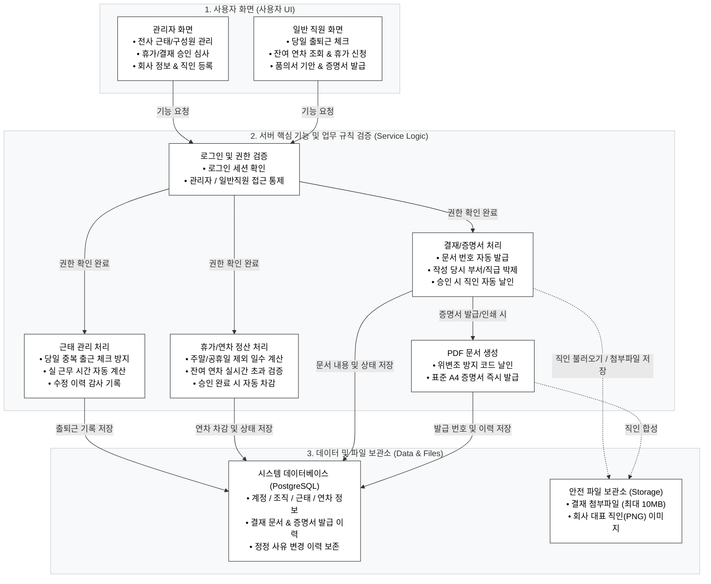

# [시스템 아키텍처 및 보안 설계] HRIS System (Phase 1 MVP)

> 본 문서는 **HRIS System (Phase 1 MVP)**의 화면 및 기능 기획을 안정적이고 안전하게 구현하기 위해 **전체 시스템 구성 방식, 기술 스택 선정 배경, 그리고 데이터 및 권한 보안 정책**을 정의한 기획/기술 설계서입니다.

## 1. 개요 및 기술 스택 선정 이유 (Overview & Tech Stack)

### 1.1 시스템 구성 목적 및 설계 4대 원칙

|**설계 원칙**|**핵심 정의**|**기획 및 비즈니스 목적**|
|---|---|---|
|**1. 서비스 무결성 (Integrity)**|결재 완료 문서, 발급 증명서, 근태 정정 이력의 사후 변조 원천 차단|인사·노무 분쟁 예방 및 법적 효력 보장|
|**2. 빠른 응답성 (Performance)**|전 화면 및 API 응답 속도 **1.0초 이내** 유지|10~50인 초기 스타트업 임직원의 쾌적한 데일리 업무 경험 보장|
|**3. 철저한 권한 분리 (Access Control)**|최고관리자(`ADMIN`)와 일반직원(`USER`)의 2단계 엄격한 권한 격리|개인 급여성 지출 결재 및 인사 민감정보 노출 방지|
|**4. 경량화 및 개발 생산성 (Agility)**|관리 비용(DevOps)을 최소화하는 클라우드/BaaS 기반 경량 스택 채택|Phase 1 MVP의 신속한 구축 및 향후 기능 확장성 확보|

### 1.2 모듈별 채택 기술 스택 및 기획적 선정 배경

개발팀과의 얼라인(Align)을 통해 선정한 프론트엔드, 백엔드, 데이터베이스, 인프라 핵심 기술 스택 명세입니다.

|**시스템 계층**|**채택 기술 스택**|**기획 및 비즈니스 선정 배경 (Why this tech?)**|
|---|---|---|
|**화면 UI (Frontend)**|**Next.js (App Router) + Tailwind CSS**|• 서버 사이드 렌더링(SSR) 지원으로 대시보드 및 첫 화면 진입 속도 극대화      • 기획서에 정의된 반응형 레이아웃 및 직관적인 UI 컴포넌트를 빠르게 구현 가능|
|**상태 관리 및 통신**|**TanStack Query (React Query)**|• 출퇴근 체크, 휴가 신청 후 화면 데이터를 실시간으로 자동 갱신(캐싱)      • 네트워크 지연 시 중복 클릭 방지 및 로딩/에러 UI 상태 손쉬운 제어|
|**서버 및 API (Backend)**|**Next.js Server Actions / Route Handlers**|• 프론트엔드와 백엔드를 단일 프로젝트로 통합하여 개발 및 배포 속도 2배 단축      • 인증 토큰 검증 및 비즈니스 룰(잔여 연차 계산 등)을 안전하게 서버에서 처리|
|**데이터베이스 (Database)**|**PostgreSQL (Supabase)**|• 글로벌 표준 관계형 데이터베이스로 결재/근태/연차 데이터의 엄격한 무결성 보장      • 고정소수점(`NUMERIC`) 지원으로 연차(0.5일/1.0일) 계산 오차 원천 차단|
|**파일/이미지 저장소 (Storage)**|**Supabase Storage (S3 호환)**|• 대표 직인 PNG 및 결재 첨부파일(최대 10MB)을 안전하게 암호화 보관      • 접근 권한이 있는 사용자에게만 안전한 보안 링크(URL) 제공|
|**증명서/문서 렌더링**|**PDF 렌더링 엔진 (Puppeteer / React-PDF)**|• 사용자가 [PDF 다운로드] 클릭 시 위변조 방지 코드(`HR-XXXX-XXXX`)와 대표 직인을 합성하여 정규 A4 양식으로 즉시 변환|

---
## 2. 전체 시스템 구조도 (System Architecture Diagram)

사용자가 화면에서 버튼을 클릭했을 때 **어떤 화면을 거쳐, 어떤 업무 규칙을 검증하고, 어디에 최종 기록되는지**를 한눈에 보여주는 서비스 시스템 흐름도입니다.

### 2.1 한눈에 보는 서비스 시스템 흐름도 (Service Architecture Map)

### 2.2 영역별 역할 및 데이터 흐름 요약표

| **구분 (영역)**                                  | **구성 요소**                                            | **기획 의도 및 핵심 처리 역할**                                                                                                                                                                                                                                                |
| -------------------------------------------- | ---------------------------------------------------- | ------------------------------------------------------------------------------------------------------------------------------------------------------------------------------------------------------------------------------------------------------------------- |
| **1. 사용자 화면**  (`Client`)              | • 일반 직원 화면  • 관리자 전용 화면                        | • 빈칸 체크, 글자 수 제한 등 **기본 입력값 1차 확인**  • 대시보드를 통해 내 근태 현황, 남은 연차, 결재 진행 상태를 직관적으로 표출                                                                                                                                                                            |
| **2. 권한 검증**  (`Auth Check`)           | • 로그인 확인  • 권한 통제                              | • 사용자가 로그인된 상태인지 확인  • 일반 직원이 관리자 기능(회사 설정, 타인 휴가 승인 등)에 접근하지 못하도록 **화면과 서버에서 이중 차단**                                                                                                                                                                         |
| **3. 업무 규칙 검증**  (`Service Rules`)     | • 근태 관리  • 휴가 정산  • 전자결재  • 증명서 발급 | • **근태**: 하루에 두 번 출근 버튼을 누르지 못하게 막고, 출퇴근 시간 차이로 근무 시간 산출  • **휴가**: 주말을 뺀 실제 연차 일수를 계산하고, **남은 연차보다 더 많이 신청하지 못하게 검증**  • **결재**: 직원이 부서를 옮겨도 옛날 결재서에는 **기안 당시 부서/직급이 그대로 남도록 박제**  • **증명서**: 신청 즉시 회사 직인과 위변조 검증 코드(`HR-XXXX-XXXX`)를 찍어 PDF로 생성 |
| **4. 데이터 및 파일 보관**  (`Data & Storage`) | • 데이터베이스 (DB)  • 파일 보관소                        | • **DB**: 사용자 정보, 출퇴근 기록, 휴가/결재 이력 및 변경 감사 기록 보관  • **파일 보관소**: 회사 직인 투명 PNG 이미지 및 결재 시 첨부한 증빙 서류 보관                                                                                                                                                          |

---
## 3. 사용자 인증 및 인가 보안 설계 (Auth & Security Architecture)

시스템 전반의 데이터를 보호하고, 일반 직원이 접근해서는 안 되는 민감한 경영/인사 정보(급여 품의서, 전사 근태, 대표 직인 등)를 안전하게 통제하기 위한 **권한 및 보안 정책**입니다.

### 3.1 2단계 권한(`ADMIN`/`USER`) 접근 통제 매트릭스

HRIS 시스템은 역할에 따라 명확하게 권한을 분리하여 비인가 접근을 원천 차단합니다.

|**업무 모듈**|**기능 및 메뉴명**|**일반 직원 (USER)**|**최고 관리자 (ADMIN)**|**기획 및 보안 통제 목적**|
|---|---|---|---|---|
|**인증 및 마이페이지**|내 프로필 및 비밀번호 변경|가능 (본인)|가능 (본인)|본인 계정 정보만 안전하게 조회 및 수정|
|**근태 관리**|출퇴근 체크 및 내 기록 조회|가능 (본인)|가능 (전사)|일반 직원은 본인 기록만, 관리자는 전사 통계 조회|
||근태 시각 직접 정정|가능 (본인)|가능 (전사)|사유 입력 및 감사 로그 기록 필수|
|**휴가 관리**|잔여 연차 조회 및 휴가 신청|가능 (본인)|가능 (본인)|본인 한도 내에서만 연차 상신 가능|
||휴가 승인/반려 심사|**불가 (차단)**|**가능**|관리자만 최종 승인 및 연차 차감 처리 권한 보유|
|**전자결재**|품의서 기안 (일반/지출/교육)|가능|가능|모든 임직원이 기안 가능|
||결재 승인 (직인 날인) / 반려|**불가 (차단)**|**가능**|최고 관리자(대표이사)만 최종 직인 날인 권한 보유|
|**증명서 발급**|재직/경력증명서 즉시 발급|가능 (본인)|가능|본인 인증 후 PDF 즉시 발급 및 이력 저장|
|**구성원 및 설정**|신규 입사자 이메일 초대|**불가 (차단)**|**가능**|7일 유효 초대 링크 발송 및 권한 부여|
||회사 정보 및 대표 직인 수정|**불가 (차단)**|**가능**|법인 공인 인감 및 사업자 정보 무단 변경 방지|

### 3.2 보안 쿠키(`HttpOnly`) 기반 세션 및 인증 처리

로그인 세션 유지와 보안 취약점(XSS 등) 방지를 위해 업계 표준 인증 방식을 채택했습니다.

|**보안 항목**|**적용 방식 및 규칙**|**기획 및 보안 목적**|
|---|---|---|
|**인증 토큰 저장소**|브라우저의 일반 저장소가 아닌 **보안 쿠키 (`HttpOnly Secure Cookie`)**에 토큰 보관|자바스크립트(악성 스크립트)로 토큰을 탈취하는 해킹 수법(XSS)을 원천 차단|
|**자동 전송 및 만료**|화면 이동 시 브라우저가 자동 전송하며, 특정 시간(예: 8시간) 미사용 시 세션 자동 파기|사용자가 PC를 켜둔 채 자리를 비워도 정보가 노출되지 않도록 세션 자동 관리|
|**권한 검증(인가)**|매 API 요청마다 서버에서 토큰과 사용자 권한(`ADMIN`/`USER`) 실시간 재검증|클라이언트 화면을 조작하여 권한 없는 메뉴에 접근하는 시도를 원천 봉쇄|

### 3.3 비밀번호 단방향 암호화 및 초대 토큰 유효성 정책

사용자의 핵심 계정 정보 보호와 신규 입사자 초대 과정의 보안을 강화했습니다.

|**보안 항목**|**적용 방식 및 규칙**|**기획 및 보안 목적**|
|---|---|---|
|**비밀번호 저장**|**Bcrypt 단방향 암호화** (서버 저장 시 복호화 불가 상태)|DB가 해킹당하더라도 실제 비밀번호를 알아낼 수 없도록 원문 정보를 완벽히 보호|
|**초대 링크 보안**|신규 입사자 초대 시 **7일 유효기간이 있는 1회용 고유 토큰** 생성 및 이메일 발송|초대 링크 탈취 시에도 7일 이후에는 자동으로 만료되어 정보 누출 리스크 최소화|
|**민감 정보 스냅샷**|결재 기안 시점의 부서/직급/대표 직인 정보를 **별도 스냅샷 테이블**에 기록|조직 개편으로 기안자의 소속이 바뀌어도, 과거 결재 문서의 기안 당시 정보는 변함없이 보존|

---
## 4. 데이터 불변성 및 민감정보 보호 정책 (Data Protection & Auditing)

HRIS 시스템은 인사·노무 관리의 신뢰성과 법적 효력을 담보하기 위해, 과거 이력의 임의 변경 방지(불변성)와 **민감 정보 보호**를 위한 핵심 데이터 정책을 적용합니다.

### 4.1 전자결재 및 증명서 스냅샷(Snapshot) 불변성 보장

조직 개편이나 인사 발령으로 인해 임직원의 소속 부서나 직급이 변경되더라도, **과거에 작성된 결재 문서나 발급된 증명서의 당시 기록은 절대 변하지 않도록** 보장합니다.

|**데이터 보호 항목**|**적용 방식 및 규칙**|**기획 및 비즈니스 목적**|
|---|---|---|
|**결재 문서 기안자 스냅샷**|품의서 상신 시점의 **기안자 부서명, 직급, 성명**을 문서 데이터에 직접 박제(고정)하여 저장|추후 기안자가 승진하거나 부서를 이동해도 과거 품의서의 책임 소재와 소속 정보가 원형 그대로 보존됨|
|**증명서 발급 이력 관리**|재직/경력증명서 발급 시 고유 발급 번호(`CRT-YYYYMMDD-XXX`)와 위변조 방지 검증 코드 부여|퇴사자나 재직자가 제출한 증명서의 진위 여부를 사후에 완벽하게 검증할 수 있도록 지원|
|**대표 직인 날인 불변성**|결재 최종 승인 시점에 사용된 회사 대표 직인 이미지를 해당 문서 레코드에 영구 링크|추후 회사의 직인 이미지가 변경되더라도, 과거 승인 완료된 문서의 직인은 당시 시점의 도장으로 유지됨|

### 4.2 근태 정정 감사 로그(Audit Log) 영구 보존

출퇴근 기록은 임금 및 근로 시간에 직결되는 민감한 데이터이므로, 임의 수정에 따른 노무적 리스크를 방지하기 위해 **모든 정정 이력을 투명하게 추적**합니다.

|**감사 로그 항목**|**적용 방식 및 규칙**|**기획 및 비즈니스 목적**|
|---|---|---|
|**정정 이력 영구 기록**|출퇴근 시각을 직접 수정(`FN-09`)하는 경우, **[수정 전 시간] ➡️ [수정 후 시간]** 값과 변경 시각을 변경 불가능한 로그 테이블에 별도 적재|관리자나 사용자가 출퇴근 기록을 임의로 은폐하거나 조작하는 행위를 사전에 억제하고 투명성 확보|
|**정정 사유 필수 입력**|근태 시각 정정 요청 시 **최대 200자 이내의 정정 사유**를 필수로 입력해야만 저장 완료 처리|노동법 감사 및 사내 인사이트 분석 시 근거 자료로 활용 가능|

### 4.3 대표 직인(인감) 및 첨부파일 접근 보안

법적 효력을 지닌 대표 직인 이미지와 임직원이 업로드한 결재 첨부파일의 무단 유출 및 외부 접근을 철저히 통제합니다.

|**파일 보호 항목**|**적용 방식 및 규칙**|**기획 및 보안 목적**|
|---|---|---|
|**대표 직인 이미지 격리**|투명 배경의 법인 직인 PNG 파일을 일반 공개 폴더가 아닌 **보안 스토리지의 암호화된 전용 경로**에 보관|외부 사용자가 주소창을 통해 법인 인감 이미지를 무단으로 다운로드하거나 도용하는 것을 원천 차단|
|**첨부파일 권한 제어**|전자결재 품의서에 첨부된 증빙 파일은 **권한이 부여된 결재선 참여자 및 관리자**만 조회 및 다운로드 가능|개인정보나 대외비가 포함된 지출 증빙 서류가 사내 전체에 무단 노출되는 리스크 방지|
