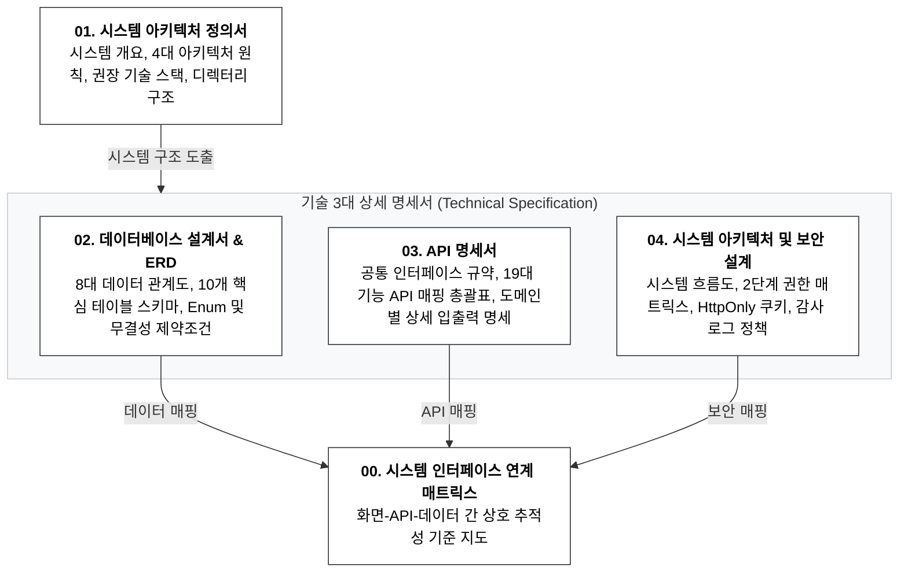

# [기술 산출물 가이드] HRIS System (Phase 1 MVP)

## 📌 기술 산출물 구조 및 공식 명칭 정의

| **번호** | **산출물명 (공식 문서 타이틀)**                                                | **핵심 질문**                       | **주요 내용 및 포함 범위**                                                                                                                                | **주요 활용 대상**           |
| ------ | ------------------------------------------------------------------- | ------------------------------- | ------------------------------------------------------------------------------------------------------------------------------------------------ | ---------------------- |
| **00** | **시스템 인터페이스 연계 매트릭스**   _(Interface Traceability Matrix)_  | **화면과 API/데이터가 어떻게 연결되는가?**     | • 화면(`SCR`) $\rightarrow$ API(`FN`) $\rightarrow$ 데이터 계층 간 1:1/1:N 연계 총괄표  • 모듈별 엔드포인트 경로, HTTP 메서드 및 권한 통제 기준 안내                          | 풀스택 개발자, PM, QA 검수자    |
| **01** | **시스템 아키텍처 정의서**  (System Architecture Definition)            | **어떤 구조와 기술로 시스템을 구현하는가?**      | • 시스템 개요 및 4대 엔지니어링 아키텍처 원칙  • 권장 기술 스택 및 계층별 선정 이유 (Next.js, PostgreSQL, Puppeteer)         • 프로젝트 디렉터리 구조 및 모듈별 역할 정의     | C-Level, 백엔드/프론트엔드 개발자 |
| **02** | **데이터베이스 설계서 & ERD**         (Database Design & ERD) | **데이터는 어떻게 모델링되고 저장되는가?**       | • 8대 핵심 데이터 관계도(ERD) 및 비즈니스 관점의 관계 요약표  • 10개 핵심 테이블 상세 스키마 (조직, 근태, 휴가, 결재, 증명서, 설정)  • 공통 상태값(Enum) 및 무결성 제약조건(Unique Constraints) | 백엔드 개발자, DB 관리자        |
| **03** | **API 명세서**  (API Specification)                              | **화면과 서버 간 인터페이스 규격은 무엇인가?**    | • 공통 인터페이스 규약 및 성공/실패 응답 표준화  • 19대 세부 기능별 API 엔드포인트 총괄표 (`FN-01` ~ `FN-19`)  • 도메인별 상세 입출력 명세 (요청 파라미터 및 응답 데이터)                    | 프론트엔드/백엔드 개발자, QA 검수자  |
| **04** | **시스템 아키텍처 및 보안 설계**  (System Architecture & Security)        | **시스템 보안과 데이터 무결성은 어떻게 통제되는가?** | • 4계층 서비스 흐름도 및 계층별 역할 요약  • 2단계 권한(`ADMIN`/`USER`) 접근 통제 매트릭스    • 보안 쿠키(`HttpOnly`) 세션 관리 및 감사 로그(Audit Log) 정책                    | 풀스택 개발자, 보안 담당자        |

## 📑 산출물별 상세 목차 및 핵심 요약

### 1. 시스템 아키텍처 정의서

> 프론트엔드, 백엔드, 데이터베이스 및 외부 렌더링 엔진 간의 시스템 구조와 핵심 데이터 흐름을 정의하는 최상위 기술 아키텍처 명세서입니다.

|**Depth 1**|**Depth 2**|**주요 내용**|
|---|---|---|
|**1. 개요 및 아키텍처 원칙**|1.1 시스템 개요 & 개발 목표|• 반응형 웹 서비스 환경 및 모듈형 단일 웹 애플리케이션 구조 정의|
||1.2 4대 엔지니어링 아키텍처 원칙|• 경량화, 데이터 무결성, 역할 기반 보안 격리, 픽셀 퍼펙트 PDF 원칙 반영|
|**2. 권장 기술 스택**|2.1 기술 스택 요약표|• Next.js, PostgreSQL, Prisma, Puppeteer, JWT 기술 스택 매핑|
||2.2 계층별 상세 선정 이유 및 역할|• 프론트엔드, DB, PDF 엔진, 인증/권한 제어별 도입 타당성 상세 기술|
|**3. 시스템 구조도 및 데이터 흐름**|3.1 전체 시스템 구조 다이어그램|• 클라이언트-서버-DB-스토리지 간의 데이터 통신 및 처리 파이프라인 시각화|
||3.2 3대 핵심 비즈니스 데이터 흐름|• 사용자 인증, 결재 직인 날인, 증명서 PDF 발급 흐름도 정의|
|**4. 프로젝트 디렉터리 구조**|4.1 전체 디렉터리 트리|• Next.js App Router 기반의 모듈형 코드베이스 트리 구조 명세|
||4.2 주요 디렉터리별 역할 및 설계 기준|• 화면 라우팅, API 엔드포인트, UI 컴포넌트, PDF 템플릿 매핑 기준 정의|

### 2. 데이터베이스 설계서 & ERD

> PostgreSQL을 기준으로 8대 핵심 업무 모듈의 테이블 스키마, 외래키 관계 및 데이터 무결성 제약조건을 정의하는 물리 데이터베이스 설계서입니다.

|**Depth 1**|**Depth 2**|**주요 내용**|
|---|---|---|
|**1. 개요 및 데이터 설계 원칙**|1.1 데이터베이스 환경 및 명명 규칙|• PostgreSQL 15+, TIMESTAMPTZ, 스네이크 케이스 명명 표준 정의|
||1.2 전 테이블 공통 메타 컬럼|• 고유 식별자(`id`), 생성/수정 일시(`created_at`, `updated_at`) 필수 포함|
||1.3 3대 데이터 설계 원칙|• 트랜잭션 원자성(ACID), 감사 추적성(Audit), 출력 스냅샷 보존 기준|
|**2. 전체 데이터 관계도**|2.1 8대 핵심 데이터 관계도|• 회사, 부서, 임직원, 출퇴근, 연차, 결재, 증명서 간의 참조 관계도|
||2.2 비즈니스 관점의 데이터 관계 요약표|• 1:1 및 1:N 관계에 따른 실무 비즈니스 규칙 정의|
|**3. 도메인별 상세 테이블 스키마**|3.1 조직 및 임직원 계정 모듈|• `departments`, `users`, `invitations` 테이블 컬럼 및 제약조건|
||3.2 근태 관리 및 정정 이력 모듈|• `attendances`, `attendance_correction_logs` 테이블 스키마|
||3.3 휴가 관리 모듈|• `vacation_balances`, `vacation_requests` 테이블 스키마|
||3.4 전자결재 문서 모듈|• `documents`, `document_attachments` 및 스냅샷 컬럼 정의|
||3.5 증명서 발급 모듈|• `certificate_issues` 및 검증 코드, 스냅샷 메타 정의|
||3.6 회사 설정 및 직인 모듈|• `company_settings` 법인 인감 및 기본 정보 단일 레코드 정의|
|**4. 공통 상태값 및 무결성 제약**|4.1 시스템 표준 열거형 타입 (Enum)|• UserRole, UserStatus, VacationType, ApprovalStatus 등 코드값 정의|
||4.2 중복 방지 제약조건|• 이메일, 사번, 당일 출퇴근, 연도별 연차 중복 방지 유니크 제약|

### 3. API 명세서

> 화면설계서 및 기능정의서 요구사항을 바탕으로 프론트엔드 화면과 백엔드 서버 간의 데이터 송수신 및 인터페이스 규칙을 정의한 기획 명세서입니다.

|**Depth 1**|**Depth 2**|**주요 내용**|
|---|---|---|
|**1. 개요 및 공통 인터페이스 규약**|1.1 기본 연동 규칙 및 인증 정책 요약|• Base URL(`/api/v1`), 보안 쿠키 세션, KST 표준 시간 기준 정의|
||1.2 화면-서버 간 공통 데이터 응답 규칙|• 성공(`success: true`) 및 실패(`success: false`) 표준 JSON 응답 포맷|
||1.3 상황별 시스템 피드백 및 예외 매핑표|• 에러 코드(`code`)와 화면 노출 안내 메시지 매핑 기준|
|**2. 19대 세부 기능별 API 총괄표**|2.1 19대 세부 기능 API 매핑 총괄표|• `FN-01` ~ `FN-19` 기능별 HTTP 메서드, 경로, 접근 권한 매핑|
||2.2 부가 관리자 설정 API 요약표|• 구성원 관리(`MEM`) 및 회사 설정(`SET`) 보조 엔드포인트 규격|
|**3. 도메인별 상세 API 명세**|3.1 인증 및 계정 관리 모듈 (`LOG`, `MY`)|• 로그인, 로그아웃, 초대 비밀번호 설정, 프로필 조회, 비밀번호 변경|
||3.2 근태 관리 모듈 (`ATT`)|• 출근/퇴근 체크, 근태 기록 조회, 출퇴근 시각 직접 정정|
||3.3 휴가 관리 모듈 (`VAC`)|• 잔여 연차 조회, 휴가 신청, 심사 목록 조회, 승인/반려/취소|
||3.4 전자결재 문서 모듈 (`DOC`)|• 결재 문서 기안, 목록/상세 조회, 승인/반려 심사|
||3.5 증명서 발급 모듈 (`CRT`)|• 증명서 즉시 발급 및 PDF 스트림 다운로드|
||3.6 구성원 및 회사 설정 모듈 (`MEM`, `SET`)|• 신규 구성원 이메일 초대 및 회사 정보/대표 직인 수정|

### 4. 시스템 아키텍처 및 보안 설계

> 전사 시스템의 데이터 무결성과 민감 정보 보호를 위해 2단계 권한 통제, 보안 쿠키 세션, 그리고 감사 로그 및 스냅샷 정책을 정의한 보안 설계서입니다.

|**Depth 1**|**Depth 2**|**주요 내용**|
|---|---|---|
|**1. 개요 및 기술 스택 선정**|1.1 시스템 구성 목적 및 설계 4대 원칙|• 서비스 무결성, 빠른 응답성(1.0초), 철저한 권한 분리, 경량화 원칙|
||1.2 모듈별 채택 기술 스택 및 선정 배경|• Next.js, TanStack Query, PostgreSQL, Supabase Storage 연동 배경|
|**2. 전체 시스템 구조도**|2.1 한눈에 보는 서비스 시스템 흐름도|• 무채색 기반의 클라이언트-서버 로직-데이터 스토리지 간 서비스 흐름도|
||2.2 영역별 역할 및 데이터 흐름 요약표|• 사용자 화면, 권한 검증, 업무 규칙 검증, 데이터 보관소 역할 정의|
|**3. 사용자 인증 및 인가 보안 설계**|3.1 2단계 권한 접근 통제 매트릭스|• 일반 직원(`USER`)과 최고 관리자(`ADMIN`) 간의 모듈별 권한 통제 기준|
||3.2 보안 쿠키 기반 세션 및 인증 처리|• `HttpOnly` 쿠키 활용을 통한 XSS 방지 및 세션 자동 파기 정책|
||3.3 비밀번호 단방향 암호화 및 초대 토큰|• Bcrypt 해싱 적용 및 7일 유효기간 1회용 초대 링크 보안 정책|
|**4. 데이터 불변성 및 민감정보 보호**|4.1 전자결재/증명서 스냅샷 불변성 보장|• 기안 당시 부서/직급 및 대표 직인 이미지 영구 박제 및 보존|
||4.2 근태 정정 감사 로그 영구 보존|• 출퇴근 시간 직접 수정 시 수정 전/후 값 및 정정 사유 불변 적재|
||4.3 대표 직인 및 첨부파일 접근 보안|• 보안 스토리지 격리 저장을 통한 인감 무단 도용 및 증빙 파일 유출 방지|
